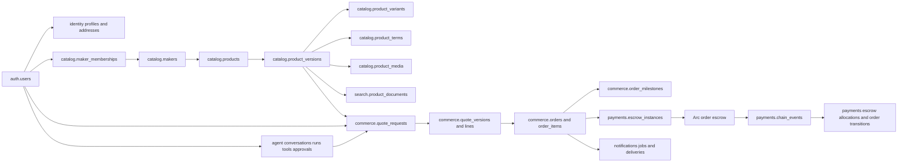
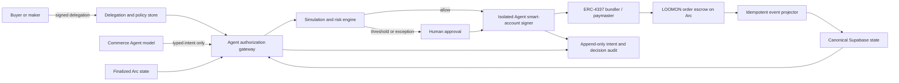

# LOOMON — Phase 2 Database and Arc Contract Plan

Status: deferred marketplace architecture; superseded for current execution by `docs/CUSTOM-SOUVENIR-MVP-PLAN.md`
Date: 2026-07-22
Depends on: `codex.md`, `docs/PLAN.md`, `docs/contract-order-lifecycle.md`
Frontend status: frozen; Phase 2 may add integration states but must not redesign the approved surfaces

## 1. Phase outcome

Phase 2 creates a production-shaped foundation for LOOMON before backend features are connected to the frozen frontend.

The phase is complete only when:

1. Supabase can be rebuilt from an empty database using a reviewed migration chain.
2. Product, maker, quote, order, payment, wallet, Agent, notification, collection, follow, review, and audit data are normalized and protected by constraints and RLS.
3. Every issued commercial document references immutable product and price snapshots.
4. The Arc contract has an executable specification, Foundry tests, and an event model that maps deterministically into Supabase.
5. The authority boundary is explicit: Supabase owns commercial and operational facts; the Arc contract owns custody and settlement facts.
6. No PII or mutable product description is placed onchain or inside search embeddings.

This phase does not connect the entire frontend or enable mainnet payments. It does design and test bounded autonomous spending for first-class Agent smart accounts on Arc Testnet; production authority is enabled only after policy, security, and contract gates pass.

## 2. Audit of the current foundation

The existing migrations prove the intended architecture but are still prototype migrations. They contain useful catalog versioning, taxonomy, RLS, search, quote, invoice, order, wallet, payment, Agent, and reminder structures. They must not be extended blindly because several production-critical domains are missing or underspecified.

### Keep conceptually

- Separate schemas for catalog, commerce, Agent, wallets, payments, search, notifications, and internal operations.
- Maker organizations separated from authenticated users.
- Immutable product versions and a single published-version pointer.
- Controlled taxonomy with localized labels and synonyms.
- Seller ingestion, validation issues, and field provenance.
- Quote versions, invoice snapshots, order history, payment intents, and chain transaction records.
- Public projections and hybrid search documents derived from canonical records.
- RLS based on buyer ownership and maker membership.
- Idempotent email queue claiming with `for update skip locked`.

### Must be corrected before production

- Replace general monetary `numeric(20,6)` usage with integer minor-unit fields plus explicit currency decimals.
- Add public opaque identifiers without using random UUIDv4 as the clustered primary key of high-write tables.
- Add maker public-profile versioning and localization instead of mixing mutable public story fields into the maker identity row.
- Add normalized collections and collection memberships for wide discovery banners.
- Add follows, reviews, review eligibility, and derived seller statistics required by the frozen frontend.
- Replace free-form quote configuration snapshots as the only source with normalized requirement/value tables; keep JSON only as a bounded immutable rendering snapshot.
- Add quote lines, adjustments, taxes/fees, acceptances, and exact catalog-version snapshots.
- Add order items, participants, address snapshots, production milestones, evidence, design approvals, shipments, disputes, and dispute decisions.
- Add contract version, escrow instance, onchain event, log cursor, reconciliation, and payment-allocation tables.
- Add Agent runs, approvals, memory provenance, and recommendation evidence rather than storing only conversations and tool calls.
- Add delivery attempts and a generic job/outbox foundation instead of coupling business transitions directly to external HTTP calls.
- Add append-only audit events and idempotency records for every privileged state transition.
- Close missing foreign-key indexes and make RLS helper functions explicit, indexed, and `security definer` safe with an empty `search_path`.

### Migration strategy

There is no production database or customer data to preserve. Therefore Phase 2 will replace the current five prototype migrations with a clean, ordered v1 migration chain. We will not stack corrective migrations on top of a schema that has not yet been released.

Before replacement:

1. Tag the current commit in Git as the frontend/prototype baseline.
2. Preserve the current migration inventory in Git history; do not copy obsolete SQL into the new runtime path.
3. Build the replacement chain on a dedicated branch.
4. Prove `supabase db reset` from empty state before merging.

After any shared or production Supabase environment contains real data, migrations become append-only and are never rewritten.

## 3. Locked architectural boundaries

| Fact | Canonical authority | Notes |
|---|---|---|
| User profile, private address, locale | Supabase | PII is never onchain or embedded. |
| Maker identity, membership, verification | Supabase | Membership controls seller authorization. |
| Product, taxonomy, media, customization | Supabase | Published versions are immutable. |
| Buyer requirements and seller quote | Supabase | Accepted quote version produces an immutable terms hash. |
| Order operational state | Supabase | Must be consistent with the latest finalized chain event. |
| Escrow custody and released/refunded amounts | Arc contract | Chain is authoritative for funds. |
| Contract event projection | Supabase derived tables | Rebuildable from chain logs. |
| Shipping, evidence files, messages | Supabase/Storage | Only hashes may be committed onchain. |
| Agent recommendation, intent, and execution evidence | Supabase audit records | The Agent can act economically only through a separately authorized smart account and deterministic policy gate. |

Rules:

- Client code never marks an invoice paid or a milestone released.
- External API calls never execute while a database row lock is held.
- Every command that can be retried accepts an idempotency key.
- Every onchain log is deduplicated by `(chain_id, transaction_hash, log_index)`.
- A chain projector can be replayed without creating duplicate transitions, emails, or payouts.
- The Agent owns a distinct Arc smart account, but the model itself never holds signing material. A deterministic policy engine permits the Agent signer only when an explicit, bounded, unexpired delegation matches the exact typed intent.
- No Agent wallet may be an unrestricted shared custodian of buyer or seller funds.

## 4. Database conventions

### 4.1 Names and identifiers

- Lowercase `snake_case` for schemas, tables, columns, functions, constraints, and indexes.
- Internal high-write primary keys use `bigint generated always as identity`.
- `auth.users.id` remains UUID because Supabase Auth owns it.
- Externally exposed records add an opaque `public_id uuid unique default gen_random_uuid()` secondary identifier; URLs and APIs never expose sequential IDs.
- Contract order identifiers use `bytes32` derived from the immutable database order public ID, chain ID, contract version, and terms version.
- Human order references remain `LM-YY-MM-XXXXXX` and are immutable.

### 4.2 Time and lifecycle

- All instants use `timestamptz` in UTC.
- Calendar-only buyer deadlines may use `date` plus an IANA timezone.
- Lifecycle fields use constrained lowercase text codes. Display labels are localized separately.
- Terminal commercial records are archived, not deleted.
- Append-only history tables have no client update/delete policy.

### 4.3 Money and quantities

- No floating point and no general decimal money source of truth.
- Store `amount_minor bigint`, `currency_code text`, and `currency_decimals smallint` together.
- VND uses `currency_decimals = 0`; Arc USDC application transfers use `currency_decimals = 6`.
- `amount_atomic bigint` is required for every USDC invoice, escrow allocation, release, refund, and fee.
- Quote totals are recomputed and checked server-side from immutable lines and adjustments.
- Percentages and fees use integer basis points with explicit caps.
- Canonical physical units are integer millimeters, grams, milliliters, pieces, and production days.

### 4.4 Text, JSON, and localization

- Use `text`; length requirements belong in checks or validation schemas.
- JSONB is allowed only for versioned, bounded payloads such as rendering snapshots, tool inputs/outputs, provider payloads, and typed customization constraints.
- Searchable/filterable commercial facts must have relational columns or join tables.
- Localized content uses `(entity_id, locale)` compound uniqueness.
- Vietnamese is required for initial publication. English may be draft-generated but must record provenance and review state.

### 4.5 Constraints and indexes

- Index every foreign key used in joins, deletes, RLS, or list filters.
- Composite indexes put equality fields first and cursor/range fields last.
- Partial indexes cover active memberships, published products, open orders, due jobs, and unreconciled chain events.
- GIN indexes are reserved for `tsvector`, arrays that are genuinely queried, and bounded JSON containment.
- Product/feed pagination uses keyset cursors, never deep `offset` pagination.
- Unique constraints enforce one published product version, one primary wallet, one active seller membership per user/maker, one event projection, and one idempotency result.

## 5. Target schema map

## 6. Identity, maker, and social domain

### `identity.profiles`

- `user_id` PK/FK to `auth.users`.
- Display name, avatar asset, preferred locale, timezone, buyer/seller onboarding state.
- No wallet address and no delivery address embedded in the profile row.

### `identity.addresses`

- One user may own multiple addresses.
- Recipient, phone, address lines, ward/district/province, postal code, country, label, and default flag.
- Sensitive fields are encrypted at the application boundary before storage; country/province codes may remain queryable where needed for logistics.
- Only the owner and trusted order service can read them.

### `catalog.makers`

- Stable organization identity: public ID, slug, legal identity reference, verification status, country/province, operational defaults, active profile version.
- Legal/private verification records live in a separate restricted table.

### `catalog.maker_profile_versions` and `catalog.maker_profile_localizations`

- Version public name, story, specialties, location label, policies, hero/logo media, and contact visibility.
- Publishing a new profile version never rewrites the profile snapshot referenced by an existing quote or order.

### `catalog.maker_memberships`

- Roles: owner, manager, catalog editor, order manager, support, viewer.
- Status: invited, active, suspended, revoked.
- Membership role and active status are indexed for RLS.

### Social tables

- `social.maker_follows`: unique user/maker pair, created timestamp.
- `social.product_saves`: user/product and optional collection/board context.
- `social.reviews`: order-linked review with rating, text, moderation state, publication state.
- `social.review_dimensions`: optional quality, communication, packaging, and on-time scores.
- `social.maker_metrics`: derived projection for sold order count, rating, review count, response rate, and on-time rate; never directly seller-editable.

Review eligibility requires a completed order containing an item from that maker. One review per buyer/order/maker is enforced by a unique constraint.

## 7. Catalog normalization

### Stable identity and immutable versions

- `catalog.products`: stable product identity, maker, slug, lifecycle, current published version.
- `catalog.product_versions`: production model, MOQ, lead-time range, origin, customization flag, schema version, workflow state, provenance timestamps.
- Once published or referenced by an issued quote, a version is immutable.
- Editing creates the next version; publication atomically changes the product pointer and emits an outbox event.

### Localized content

- `catalog.product_localizations`: title, summary, story, care, production notes, SEO copy per version/locale.
- `catalog.variant_localizations`: variant labels and descriptions.
- `catalog.media_localizations`: alt text and captions per media role/locale rather than fixed `alt_text_vi`/`alt_text_en` columns.

### Variants and option structure

- `catalog.product_variants`: immutable variant identity within a product version; dimensions, weight, volume, pack quantity, SKU, active flag.
- `catalog.option_definitions`: size, glaze, finish, color, packaging, or other seller-supported option type.
- `catalog.option_values`: controlled values with stable codes.
- `catalog.variant_option_values`: normalized variant/value assignment.
- Dimensions remain typed columns because they are hard search filters; they are not generic JSON attributes.

### Pricing

- `catalog.price_lists`: product-version currency and validity window.
- `catalog.price_tiers`: optional variant, minimum/maximum quantity, unit amount in minor units, price type, source, validity.
- Quantity tiers must be ordered, non-overlapping, and unique for a price list/variant/range.
- `quote_only` has no fabricated amount.
- Buyer currency conversion is a derived estimate until the seller issues a quote in a supported settlement currency.

### Taxonomy

- `catalog.vocabularies`, `terms`, `term_localizations`, `term_synonyms`, `product_terms` remain normalized.
- Initial controlled vocabularies: category, material, technique, finish, color family, style, usage, occasion, recipient, cultural region, sustainability, customization capability.
- AI-suggested assignments require confirmation before publication.
- Deprecated terms remain resolvable for historic product versions.

### Customization

- `catalog.customization_definitions`: platform-controlled input and value type.
- `catalog.customization_localizations`: label, instructions, examples.
- `catalog.product_customizations`: version-specific support, required-for-quote flag, price/lead-time behavior.
- `catalog.customization_choices`: normalized select/multiselect choices.
- Free text is allowed only when the definition explicitly permits it.

### Media and rights

- `catalog.media_assets`: maker owner, bucket/path, MIME, bytes, dimensions, checksum, source, rights, moderation, derivatives.
- `catalog.product_media`: product version, asset, role, order, focal point.
- `catalog.collections`: curated collection identity, slug, publication window, banner asset, editorial priority.
- `catalog.collection_localizations`: title and description.
- `catalog.collection_products`: explicit ordered product membership and optional featured version.
- Wide discovery tiles always resolve from a collection banner, never from stretched product photography.

### Seller ingestion and provenance

- `catalog.import_jobs`, `import_rows`, `validation_issues`, and `field_provenance` remain.
- Add `catalog.ingestion_runs` and `catalog.ai_suggestions` so Agent extraction is auditable and separately confirmable.
- Raw import payloads have a retention period and never become public catalog data.
- Seller import follows upload → parse → normalize → validate → preview → confirm → draft creation; it never publishes directly.

## 8. Commerce normalization

### Quote request

- `commerce.quote_requests`: buyer, maker, locale, deadline, status, source conversation.
- `commerce.quote_request_items`: exact product/version/variant, requested quantity.
- `commerce.requirement_definitions`: commercial requirement code and typed value rules.
- `commerce.quote_item_requirements`: normalized requested value, provenance, confirmation state, and optional attachment.
- `commerce.requirement_messages`: links clarification messages to the requirement they changed.

### Quote version

- `commerce.quote_versions`: immutable issued document header, currency, validity, deposit policy, terms hash, status.
- `commerce.quote_lines`: product/variant snapshot, quantity, unit amount minor, line total minor, maker SKU snapshot.
- `commerce.quote_adjustments`: shipping, customization, discount, platform fee, tax, or other typed adjustment.
- `commerce.quote_terms`: lead time, required date, cancellation terms, revision limits, deliverables, and acceptance criteria.
- `commerce.quote_acceptances`: buyer/seller actor, quote version, accepted timestamp, wallet signature/authorization evidence where applicable.
- The stored rendering snapshot is JSONB, but totals and enforceable fields remain relational.

### Order

- `commerce.orders`: immutable public reference, buyer, maker, accepted quote, operational status, terms hash, escrow mode.
- `commerce.order_participants`: buyer, seller organization, support, resolver roles and validity windows.
- `commerce.order_items`: exact quote line and catalog version snapshots.
- `commerce.order_address_snapshots`: encrypted delivery details copied at confirmation so later profile edits do not alter the order.
- `commerce.order_status_history`: append-only transitions with actor, reason, command id, correlation id.
- State transitions occur only through server functions that lock the order row briefly and validate the expected prior state.

### Production, delivery, and dispute

- `commerce.order_milestones`: ordered production/payment milestone, amount atomic, due dates, review window, current state.
- `commerce.milestone_evidence`: structured evidence type, private asset, checksum/hash, submitted actor and timestamp.
- `commerce.design_approvals`: versioned design proof, buyer decision, comments, deadline.
- `commerce.shipments`: carrier, tracking reference, shipment status, shipped/delivered timestamps.
- `commerce.shipment_events`: provider event deduplication and raw bounded payload.
- `commerce.disputes`: reason code, disputed amount, opened by, state, resolver, resolution deadline.
- `commerce.dispute_evidence`: private evidence and statement provenance.
- `commerce.dispute_decisions`: immutable buyer amount, seller amount, fee result, decision hash, resolver, timestamp.

Database checks require milestone amounts to equal the funded commercial total before an escrow can be activated. Cross-row total checks run through a privileged transaction function, not a fragile row-level check constraint.

## 9. Wallet, payment, and chain projection

### Wallet identity

- `wallet.accounts`: owner type (`user`, `maker`, `agent`, `platform`), owner reference, provider, account type (`eoa`, `smart_account`), custody type, chain, normalized lowercase address, verification evidence, primary flag.
- Unique `(chain_id, address)` prevents one wallet being silently linked to multiple users.
- `wallet.link_challenges`: nonce, domain, issued/expiry, used timestamp.
- `wallet.delegations`: grantor, grantee Agent wallet, policy version/hash, order/maker/category scope, validity window, revocation nonce, authorization evidence, state.
- `wallet.delegation_capabilities`: normalized capability rows with allowed chain, token, contract, function selector, recipient, per-action limit, rolling-period limit, total delegated budget, and human-approval threshold.
- `wallet.session_keys`: public-key reference, secure-signer/provider reference, activation/expiry, policy hash, revocation state; never private key material.
- The Agent cannot insert, expand, renew, or reactivate its own delegation. Only the owner or an approved recovery authority can grant/revoke it.

### Payment intent and transaction

- `payments.payment_intents`: invoice/order/milestone, expected sender, receiver/escrow, token, exact atomic amount, expiry, idempotency key, state.
- `payments.transactions`: chain, hash, sender, recipient, token, value, receipt status, block number/hash, finalized timestamp.
- `payments.payment_allocations`: maps one verified transaction or escrow event to an invoice/milestone without reuse.
- Unique chain/transaction constraints prevent replay across invoices.

### Contract registry and escrow projection

- `payments.contract_versions`: semantic version, factory, implementation, ABI hash, bytecode hash, deployment transaction/block, active-for-new-orders flag.
- `payments.escrow_instances`: order, contract version, escrow address, bytes32 order ID, terms hash, parties, total, state, creation/funding/finalization references.
- `payments.escrow_milestone_allocations`: database milestone ↔ contract milestone index and projected released/refunded values.
- `payments.chain_events`: chain ID, contract, block, transaction, log index, event signature, decoded payload, processing state.
- `payments.projector_cursors`: indexer/source and last reconciled block.
- `payments.reconciliation_runs`: range, result, mismatch count, timestamps.

The projector writes chain facts first, then invokes an idempotent domain command to change an invoice/order projection. It never edits business rows directly from an unverified webhook payload.

## 10. Agent, search, notifications, and internal operations

### Agent

- `agent.identities`: one logical Agent identity, owner scope (`buyer`, `maker`, `platform`), version, status, capabilities, policy reference, optional ERC-8004 registration and metadata hash.
- `agent.wallet_bindings`: Agent identity to exactly one active Arc smart account per purpose, with activation and replacement history.
- `agent.conversations`, `messages`.
- `agent.runs`: model, prompt/policy version, user, start/end, outcome, token/cost metadata.
- `agent.tool_calls`: validated input/output, authorization context, idempotency key, error category.
- `agent.action_approvals`: proposed action, exact payload hash, approver, expiry, consumed timestamp.
- `agent.transaction_intents`: typed action, exact calldata/semantic payload hash, initiating run, delegation, order, amount, target, nonce, state, idempotency key.
- `agent.transaction_simulations`: intent, chain snapshot/block, simulation provider, decoded asset changes, gas estimate, result and failure reason.
- `agent.risk_decisions`: intent, policy version, rule results, budget state, risk score, decision (`allow`, `human_approval`, `deny`), immutable reason codes.
- `agent.execution_attempts`: intent, signer/provider request, user-operation or transaction hash, attempt, state, error class, receipt reference.
- `agent.budget_ledger`: append-only reserved, consumed, released, and reversed atomic amounts per delegation/capability/period.
- `agent.emergency_stops`: scope, actor, reason, activation, clearance, and audit link.
- `agent.memory_facts`: scope, source, confidence, sensitivity, expiry, verification state.
- `agent.recommendation_sets` and `recommendation_items`: exact product version, score components, matched evidence, exclusions.
- Agent-generated content is never written into confirmed commercial columns without a user/seller confirmation record.

### Agent wallet and maximum-autonomy model

LOOMON treats the Agent as a first-class economic participant, not merely a chat interface. Arc supports ERC-4337 smart accounts and an ecosystem of bundlers, paymasters, session-key infrastructure, and programmable signer providers. Arc also documents ERC-8004 identity/reputation for autonomous agents. Phase 2 evaluates providers through an ADR and uses only capabilities proven on Arc Testnet.

Wallet classes:

1. **Buyer Agent Smart Account:** operates within a buyer-granted order or rolling purchase budget.
2. **Maker Agent Smart Account:** accepts eligible orders, submits milestones/evidence, manages settlement, and pays approved maker operating costs.
3. **Platform Operations Agent:** sponsors permitted gas, sends notifications, reconciles transactions, and performs explicitly authorized platform actions. It cannot custody or redirect customer escrow.

Autonomy modes are explicit state, not prompt wording:

| Mode | Authority |
|---|---|
| `observe` | Read, analyze, monitor, and notify only. |
| `prepare` | Build and simulate an action; human signs every transaction. |
| `execute_limited` | Sign actions that match capability, scope, budget, recipient, contract, token, and time policy. |
| `managed_commerce` | Run an approved order end to end inside its total order budget and exception policy. |
| `frozen` | No new signing; read, reconcile, revoke, and safe-withdraw paths remain. |

Before every signature, the wallet gateway must verify chain ID, approved Arc contract version, function selector, token, recipient, exact asset delta, allowance, balance, contract state, nonce, expiry, delegation scope, remaining budget, simulation result, compliance result, anomaly rules, and idempotency. A failed or ambiguous check denies execution; it never falls back to model judgment.

Deep autonomous capabilities may include:

- create a quote/order/escrow from confirmed structured terms;
- accept an order for a maker when SKU, capacity, price, lead time, and policy match;
- fund an exact order escrow inside the buyer's reserved budget;
- submit milestone and evidence hashes;
- approve/release a milestone only when the buyer delegated that exact capability and its risk/amount threshold is not crossed;
- raise a dispute, request clarification, or pause instead of paying when evidence conflicts;
- withdraw claimable funds only to a pre-approved settlement address;
- execute contract-permitted cancellation/refund paths and pay approved operating expenses;
- monitor balances, deadlines, receipts, email reminders, and reconciliation continuously.

Human approval remains mandatory when a new recipient or contract is introduced, an amount/period limit is crossed, delegation is missing/expired, terms changed after approval, simulation differs from intent, risk/compliance rules fail, or a dispute requires impartial judgment. The resolver must be independent from any Agent that acted for either party.

The language model can call only high-level typed tools such as `fund_order(order_id)` or `approve_milestone(order_id, index)`; it cannot issue arbitrary calldata, read private keys, or call the signer directly. The authorization service converts a typed intent into calldata only after loading canonical database and contract state. Signing keys live in an isolated MPC/HSM/provider-controlled signer or a reviewed session-key module, never in Supabase, logs, prompts, browser storage, or environment exposed to the model.

### Search

- `search.product_documents`: product/version/locale, deterministic canonical content, stored `tsvector`, embedding and model metadata.
- `search.index_jobs`: queued rebuild by product version and locale.
- Search documents exclude private notes, addresses, emails, messages, wallet data, and order data.
- Hard constraints run before semantic ranking.

### Notifications

- `notifications.preferences`: channel and event scope per user.
- `notifications.order_preferences`: order-specific recipient confirmation and reminder choices.
- `notifications.reminders`: scheduled logical reminder with deduplication key.
- `notifications.delivery_attempts`: provider, attempt number, provider message ID, response category, retry timestamp.
- Provider calls are performed after atomically claiming jobs with `skip locked`.

### Internal reliability

- `internal.outbox_events`: domain event, aggregate, payload version, deduplication key, publish state.
- `internal.jobs`: generic background job with attempts, lock owner/time, next attempt and dead-letter state.
- `internal.idempotency_keys`: actor/scope/key, request hash, result reference, expiry.
- `internal.audit_events`: append-only actor, action, target, before/after hashes, correlation, IP/user-agent where legally appropriate.
- `internal.platform_roles`: tightly controlled support/reviewer/admin roles; never inferred from client input.

## 11. RLS and privilege model

Only the `public` API schema is exposed to the browser. Canonical schemas are accessed through security-invoker views and narrowly scoped RPC functions. Server services use pooled connections and explicit roles.

| Role | Allowed access |
|---|---|
| Anonymous | Published maker/product/collection/search/review projections only. |
| Buyer | Own profile, addresses, follows, saves, conversations, quotes, orders, payments, reminders, and eligible reviews. |
| Seller member | Maker data permitted by active membership role; no unrelated buyer PII. |
| Order manager | Participating maker quotes/orders and necessary delivery data only. |
| Agent tool service | Only the rows/actions allowed by the initiating user and tool contract. |
| Agent authorization service | Read exact delegation/policy/budget/contract state; append intents, simulations, risk decisions, approvals, and audit records; cannot grant delegation. |
| Isolated Agent signer | Receives only an approved immutable intent hash and signer policy reference; no general database access. |
| Worker | Claimed jobs, outbox, event projection, notifications; no general interactive access. |
| Service role | Server-only break-glass capability; never shipped to the client. |

RLS implementation rules:

- Wrap `auth.uid()` in `select` inside policies so it is evaluated once.
- Index every column used by RLS predicates.
- Complex membership checks use reviewed `security definer` helpers with `set search_path = ''` and schema-qualified objects.
- Client roles receive no table-level delete grant for immutable or historic data.
- Append-only tables expose select policies only; insertion occurs through commands/triggers.
- Every table has positive and negative pgTAP tests for anonymous, buyer A, buyer B, seller member, non-member, and service worker.

## 12. Replacement migration chain

The exact numbering is locked before implementation. Proposed chain:

1. `0001_extensions_and_schemas.sql`
2. `0002_shared_types_and_functions.sql`
3. `0003_identity.sql`
4. `0004_makers_and_social.sql`
5. `0005_catalog_core.sql`
6. `0006_catalog_taxonomy_and_customization.sql`
7. `0007_catalog_media_collections_ingestion.sql`
8. `0008_commerce_quotes.sql`
9. `0009_commerce_orders_fulfillment_disputes.sql`
10. `0010_wallets_payments_and_chain_projection.sql`
11. `0011_agent.sql`
12. `0012_search.sql`
13. `0013_notifications_outbox_audit.sql`
14. `0014_public_views_and_commands.sql`
15. `0015_rls_and_privileges.sql`
16. `0016_seed_taxonomy_and_demo_roles.sql`

Each migration must be deterministic, transactional where PostgreSQL permits, and safe to run from a clean database. Seed data uses stable codes rather than environment-specific IDs.

Required generated artifacts:

- `src/types/database.generated.ts`
- Zod schemas for public commands and Agent tools
- data dictionary under `docs/architecture/`
- ERD generated from the applied schema
- RLS matrix and test report

## 13. Arc contract architecture

### 13.1 Recommended deployment model

Use a versioned factory plus one non-upgradeable minimal-proxy escrow instance per funded order:

- `LoomonEscrowFactory`: registry of approved immutable implementations; deploys deterministic order escrows; can pause creation of new escrows.
- `LoomonOrderEscrow`: holds funds for exactly one order, parties, terms hash, milestones, dispute state, and claimable balances.

Why:

- Funds and accounting are isolated per order.
- An implementation version is pinned for the lifetime of the order.
- A new audited implementation can be registered for future orders without changing active escrow code.
- There is no upgradeable proxy admin capable of silently changing live order rules.
- Event projection is simpler because every escrow address maps to one database order.

Trade-off: more deployments and addresses than one shared vault. Arc's EVM compatibility and low-latency settlement make this acceptable for the MVP, and the factory keeps discovery deterministic.

### 13.2 Contract parties

- Buyer: accepts terms, funds, approves milestones, raises disputes, withdraws refunds.
- Seller: accepts terms, submits milestone evidence hashes, withdraws released funds.
- Resolver: a multisig-controlled dispute role; may split only the remaining escrow after a dispute.
- Fee recipient: receives the snapshotted platform fee from seller releases.
- Factory admin: multisig that can approve new implementation versions and pause new escrow creation.
- Buyer Agent operator: revocable smart-account operator that may exercise only buyer capabilities granted for this order.
- Seller Agent operator: revocable smart-account operator that may exercise only seller capabilities granted for this order.
- Platform Operations Agent: may relay/sponsor approved calls and reconcile state, but has no permission to redirect escrow funds or resolve disputes.

### 13.3 Onchain data

Store only:

- bytes32 order ID and terms hash;
- buyer, seller, resolver, fee recipient, and optional buyer/seller Agent operators;
- operator permission bitmap, delegation/policy hash, expiry, and revocation nonce;
- USDC token address and 6-decimal atomic amounts;
- fee basis points;
- acceptance/funding/review deadlines;
- milestone amount, deadline, evidence hash, and state;
- released, refunded, fee, and claimable balances.

Do not store names, email, phone, address, product description, private evidence URI, chat, tracking number, or unhashed order documents.

### 13.4 State machine

Escrow states:

`created -> seller_accepted -> funded -> active -> completed`

Alternative paths:

- `created | seller_accepted -> cancelled` before funding under deadline rules.
- `funded | active -> disputed -> resolved`.
- `funded -> refunded` when approved cancellation/refund conditions apply.

Milestone states:

`pending -> submitted -> approved -> released`

or:

`submitted -> disputed -> resolved_release | resolved_refund | resolved_split`

There is no unconditional automatic approval. A buyer Agent may approve a milestone only when an active order-scoped delegation grants `approve_milestone`, the amount/risk remains below its threshold, the evidence and simulation checks pass, and the action is auditable. Otherwise review timeout or uncertainty escalates to the buyer or independent resolver instead of automatically paying the seller.

### 13.5 Core commands

Factory:

- `createEscrow(config, milestones, salt)`
- `setImplementationAllowed(version, implementation, allowed)` for future escrows only
- `pauseCreation()` / `unpauseCreation()`

Order escrow:

- `setOperator(side, operator, permissions, policyHash, expiry, nonce)` owner-side only
- `revokeOperator(side, nonce)` owner-side only and immediately effective
- `acceptTerms()` seller-only
- `fund()` buyer-only, exact USDC amount
- `activate()` after funding and acceptance
- `submitMilestone(index, evidenceHash)` seller or authorized seller Agent
- `approveMilestone(index)` buyer or authorized buyer Agent
- `raiseDispute(index, reasonHash)` buyer or seller
- `resolveDispute(index, buyerAmount, sellerAmount)` resolver-only
- `cancelBeforeFunding()` according to party/deadline rules
- `withdraw()` pull-based transfer of claimable USDC

Every party command resolves the effective actor, validates its current operator permission/expiry/revocation nonce, and emits the principal plus actual caller. Agent operators use the same narrow state-machine commands as owners; the escrow never exposes an arbitrary Agent execution entry point.

Contract initialization validates:

- nonzero, distinct parties where required;
- supported Arc USDC ERC-20 address;
- milestone count within the approved cap;
- sum of milestone amounts equals total amount;
- fee basis points below the hard cap;
- ordered future deadlines;
- nonzero terms hash and unique factory order ID.

### 13.6 Settlement accounting

- Use `SafeERC20` against Arc's USDC ERC-20 interface.
- Funding pulls the exact total atomic amount once.
- Released seller amount, platform fee, buyer refund, remaining escrow, and claimable balances must always reconcile to total funded amount.
- Fee is charged only on seller-released value; refunded value has no platform fee.
- Rounding remainder is applied deterministically to the final seller release.
- State transitions update accounting before any token transfer.
- Payout uses claimable balances and user-initiated `withdraw` so a blocked recipient cannot prevent state finalization for other parties.

### 13.7 Security decisions

- Solidity compiler and OpenZeppelin versions are pinned.
- No proxy upgradeability for active order escrows.
- `ReentrancyGuard`, checks-effects-interactions, `SafeERC20`, explicit custom errors, and role checks are mandatory.
- Factory pause stops new escrow creation; emergency controls must not permit admin seizure of active order funds.
- Refund, dispute resolution, and withdrawal paths remain available under the approved emergency policy so pausing cannot permanently trap funds.
- No arbitrary external call, delegatecall target, token substitution, or admin withdrawal exists.
- EIP-712 delegation/intent hashes, domain separation, explicit nonces, deadlines, and replay protection are part of v1 because autonomous Agent wallets require cryptographically bound authority. Gas sponsorship remains provider-pluggable and cannot change the authorized semantic action.
- An Agent that acted for the buyer or seller cannot be the dispute resolver for that order.
- ERC-8183 is a lifecycle reference, not a dependency requirement. LOOMON adopts it only if its final standard and physical-commerce fit pass review.

## 14. Contract events and database mapping

Required events include contract version and bytes32 order ID:

- `EscrowCreated`
- `OperatorSet`
- `OperatorRevoked`
- `AgentActionExecuted`
- `TermsAccepted`
- `EscrowFunded`
- `EscrowActivated`
- `MilestoneSubmitted`
- `MilestoneApproved`
- `MilestoneReleased`
- `DisputeRaised`
- `DisputeResolved`
- `EscrowCancelled`
- `EscrowRefunded`
- `WithdrawalClaimed`

Projection sequence:

1. Webhook/indexer receives a log.
2. Worker verifies chain ID, contract registry, receipt, block, topic, and decoded ABI version.
3. Insert into `payments.chain_events` with unique log identity.
4. In one short database transaction, lock the escrow projection, verify expected prior state, apply allocation, append history/audit, and enqueue an outbox event.
5. Notification/search/analytics workers consume the outbox outside that transaction.
6. A scheduled RPC reconciliation rescans from the last safe cursor and reports any mismatch.

Arc deterministic finality means an included transaction can be treated as final for normal UX; the projector still stores block identity and supports replay/reconciliation.

## 15. Contract test plan

### Unit tests

- Initialization and all invalid-party/amount/deadline configurations.
- Buyer/seller acceptance and exact funding.
- Every valid and invalid state transition.
- Milestone submission, approval, release, refund, split, and completion.
- Fee calculation and final rounding.
- Cancellation before funding and funded cancellation policy.
- Withdrawals, zero balance, repeated withdrawal, and transfer failure behavior.
- Pause behavior and admin restrictions.

### Fuzz tests

- Random milestone amounts whose sum must equal total.
- Random fee basis points within and beyond cap.
- Random dispute splits constrained to remaining escrow.
- Random transition sequences and repeated calls.
- Boundary timestamps and maximum allowed milestone count.

### Invariants

- Contract USDC balance plus total withdrawn equals total funded.
- Released + refunded + fee + remaining equals funded.
- No milestone releases more than its allocation.
- Terminal escrow cannot be funded or transitioned again.
- Unauthorized addresses can never create claimable balances or change state.
- One database order ID can produce only one active escrow address per factory/version/salt policy.

### Security and deployment gates

- Slither/static analysis clean or all findings documented.
- Foundry unit, fuzz, and invariant suites pass.
- Fork/testnet integration verifies the actual Arc USDC interface and decimals.
- Threat model covers reentrancy, replay, allowance behavior, blacklisting/transfer failure, resolver compromise, fee rounding, deadline manipulation, front-running, pause abuse, and stuck funds.
- External review is required before any mainnet or real-value deployment.

## 16. Database test and quality plan

- Fresh `supabase db reset` applies all migrations and seed data.
- Schema test verifies PKs, FKs, checks, unique constraints, expected indexes, and grants.
- pgTAP tests cover RLS allow/deny matrices.
- State-machine tests prove invalid quote/order/payment transitions fail in the database command layer.
- Concurrency tests prove duplicate publication, duplicate quote acceptance, duplicate chain log, duplicate payment allocation, and duplicate reminder are idempotent.
- Search tests prove unpublished/private records cannot enter public documents.
- Backup/restore test proves canonical records and event cursors recover together.
- Generated TypeScript types must have no manual edits and compile with the application.

## 17. Execution work packages

### P2.0 — Approve policy decisions

Approve money rules, seller publication policy, deposit/milestone policy, resolver, platform fee, cancellation/refund rules, maximum milestones, and whether verified sellers may self-publish.

Deliverables:

- data dictionary v1;
- lifecycle/state matrix;
- threat model draft;
- ADRs for database IDs, money, contract deployment, resolver, upgradeability, and event authority.

### P2.1 — Replace and prove the migration foundation

- Create the clean migration chain.
- Add schema/RLS tests and stable taxonomy seed.
- Generate database types and ERD.
- Run migration reset twice to prove determinism.

Gate: database foundation passes without contract code.

### P2.2 — Implement commerce commands and outbox

- Implement privileged functions/services for product publication, quote issuance/acceptance, order creation, state transitions, job claiming, and idempotency.
- Add audit and outbox emission.

Gate: no client can bypass state transitions or mark payment success.

### P2.3 — Create executable contract specification

- Add Foundry workspace under `contracts/`.
- Write interfaces, state model, fixtures, and failing tests before implementation.
- Pin Arc testnet network constants in environment/config, not duplicated literals.

Gate: specification and expected event/database mapping approved.

### P2.4 — Implement and secure the contract

- Implement factory and order escrow.
- Complete unit/fuzz/invariant/static analysis.
- Produce deployment and verification scripts.

Gate: all tests and threat review pass; no real funds.

### P2.5 — Arc Testnet deployment and projector

- Revalidate Arc contract addresses and EVM differences against official docs.
- Deploy factory/implementation to Arc Testnet.
- Register version in Supabase.
- Index and reconcile test order events.
- Execute buyer fund → milestone → release/refund/dispute E2E scenarios.

Gate: Supabase projection equals onchain accounting for every scenario.

### P2.6 — Frozen frontend adapter integration

- Replace fixture adapters with typed read/write services one domain at a time.
- Add loading, error, unauthorized, wrong-network, pending-signature, and failed-transaction states.
- Do not redesign approved screens.

Gate: buyer and seller flows pass E2E on Arc Testnet.

## 18. Decisions requiring approval before implementation

Recommended defaults are listed first.

1. **Escrow deployment:** versioned factory + non-upgradeable per-order clones.
2. **Resolver:** platform multisig initially; Agent may summarize evidence but cannot resolve.
3. **Milestones:** maximum 8; deposit is milestone 0 and may be non-refundable only when the accepted quote explicitly states it.
4. **Review timeout:** escalate to resolver; no automatic seller payout in MVP.
5. **Platform fee:** snapshotted basis points per accepted quote, charged only on seller-released value, with a contract hard cap.
6. **Seller settlement:** seller's verified Arc wallet; changing it affects future orders only.
7. **Publication:** platform review for the initial seller cohort; verified self-publishing can be added later with audit gates.
8. **Currencies:** catalog may display VND/USDC; executable invoices and v1 escrow settle only in Arc USDC.
9. **Shipping address:** application-layer encrypted snapshot in Supabase; hash only if included in the signed terms document, never plaintext onchain.
10. **Contract standard:** custom physical-commerce escrow informed by ERC-8183; no dependency on an unfinished or mismatched standard without a separate ADR.
11. **Agent wallet model:** distinct ERC-4337 smart accounts for buyer, maker, and platform-operation scopes; no shared unrestricted customer-fund wallet.
12. **Default autonomy:** `execute_limited`; a user explicitly opts an individual order into `managed_commerce` with a total budget, expiry, and exception thresholds.
13. **Signer boundary:** the model emits typed intents only; a deterministic policy/risk service and isolated signer control every signature.
14. **Onchain Agent identity:** evaluate ERC-8004 on Arc Testnet and register production agents only after metadata, privacy, upgrade, and reputation governance ADR approval.

## 19. Acceptance checklist

Phase 2 is accepted only when all boxes are true:

- [ ] Policy decisions and ADRs approved.
- [ ] Clean migration chain applies from empty twice.
- [ ] Full data dictionary and ERD generated.
- [ ] Product data is normalized and Agent-searchable without relying on opaque JSON.
- [ ] Collections, follows, reviews, seller statistics, milestones, shipping, disputes, and event projection exist.
- [ ] Money and USDC boundaries use integer minor/atomic units.
- [ ] RLS positive and negative tests pass.
- [ ] Database transition, idempotency, queue, and replay tests pass.
- [ ] Foundry unit, fuzz, invariant, and static-analysis gates pass.
- [ ] Arc Testnet deployment addresses and ABI hashes are registered.
- [ ] Chain logs rebuild the payment/order projection without duplicates.
- [ ] Buyer funding, seller milestone, release, refund, and dispute E2E scenarios reconcile exactly.
- [ ] No Agent, client, or webhook can move funds or mark paid outside its authority.
- [ ] Agent wallet delegation, budget accounting, revocation, replay, simulation mismatch, and emergency-freeze tests pass.
- [ ] No model-facing process can access raw signing material or submit arbitrary calldata.

## 20. Official technical references

Revalidate these immediately before implementation and deployment:

- Arc documentation index: https://docs.arc.io/llms.txt
- Arc network and stablecoin model: https://docs.arc.io/arc-chain
- Arc eCommerce and programmable escrow: https://docs.arc.io/build/ecommerce
- Arc Agentic Economy and ERC-8183 lifecycle: https://docs.arc.io/build/agentic-economy
- Arc account abstraction and ERC-4337 providers: https://docs.arc.io/arc/tools/account-abstraction
- Arc ERC-8004 Agent identity tutorial: https://docs.arc.io/arc/tutorials/register-your-first-ai-agent
- Arc Testnet contract addresses: https://docs.arc.io/arc/references/contract-addresses
- Arc EVM differences: https://docs.arc.io/arc/references/evm-differences
- Arc deterministic finality: https://docs.arc.io/arc/concepts/deterministic-finality
- Arc contract event monitoring: https://docs.arc.io/arc/tutorials/monitor-contract-events
- Supabase RLS: https://supabase.com/docs/guides/database/postgres/row-level-security
- PostgreSQL constraints and indexing: https://www.postgresql.org/docs/current/ddl-constraints.html
