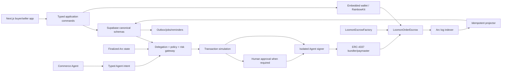

# LOOMON — Phase 2 Supabase Database, Arc Contract and Agent Wallet Execution Plan

Status: deferred marketplace execution plan; do not execute before the custom-souvenir MVP validation gates in `docs/CUSTOM-SOUVENIR-MVP-PLAN.md`
Ngày: 2026-07-22
Phương pháp: Superpowers — brainstorm → isolation → plan → TDD → critical review → verified completion
Nguồn yêu cầu: `codex.md`, `docs/PLAN.md`, `docs/PHASE-2-DATABASE-CONTRACT-PLAN.md`, `docs/contract-order-lifecycle.md`

## 1. Kết quả cuối cùng của Phase 2

Phase 2 tạo nền móng dữ liệu và thanh toán có thể kiểm chứng cho LOOMON:

1. Supabase Postgres được dựng lại hoàn toàn từ migration và seed trong repository.
2. Dữ liệu sản phẩm, seller, buyer, quote, order, wallet, Agent và payment được chuẩn hóa ngay từ đầu.
3. Mỗi quote/order giữ đúng phiên bản sản phẩm, giá và điều khoản tại thời điểm giao dịch.
4. Mỗi Agent có Arc smart account riêng và chỉ hành động trong delegation có giới hạn.
5. Arc escrow contract quản lý USDC theo từng đơn, milestone, refund và dispute.
6. Supabase chiếu trạng thái onchain bằng projector idempotent; không tin cờ `success` từ client.
7. RLS ngăn buyer, seller hoặc Agent truy cập dữ liệu ngoài phạm vi được cấp.
8. Database, contract và projector có test tự động trước khi triển khai Arc Testnet.

Phase 2 không bao gồm:

- mainnet deployment;
- redesign frontend đã freeze;
- custody không giới hạn đối với tiền của khách hàng;
- cho model truy cập private key hoặc calldata tùy ý;
- tự động giải quyết dispute bằng Agent đã đại diện buyer hoặc seller.

## 2. Cách Superpowers được áp dụng

### Brainstorm và khóa giả định

- Xác định source of truth cho từng loại dữ liệu trước khi tạo table.
- Tách dữ liệu canonical, snapshot, projection, audit và cache.
- Chốt money model, order lifecycle, Agent delegation, resolver và upgrade policy trước khi code.
- Mọi điểm chưa chốt được ghi thành ADR; không giấu quyết định trong migration hoặc contract.

### Isolation

- Tạo branch `codex/phase-2-database-contract` hoặc Git worktree riêng.
- Ghi lại commit frontend baseline trước khi thay migration prototype.
- Không sửa database remote trong lúc thiết kế và test local.
- Không chạy `supabase db reset --linked` trên bất kỳ project có dữ liệu thật.

### Plan theo task nhỏ

- Mỗi checkpoint có file cụ thể, test cụ thể, điều kiện pass/fail và rollback.
- Mỗi task chỉ sở hữu một domain hoặc một state transition.
- Không gom catalog, commerce, wallet và payment vào một migration khổng lồ.

### TDD

- Database: viết pgTAP test fail trước, sau đó viết migration/RPC nhỏ nhất để test pass.
- Contract: viết Forge unit/fuzz/invariant test fail trước, sau đó viết Solidity nhỏ nhất để pass.
- Projector: viết fixture event và idempotency test trước khi viết consumer.
- Mọi lỗi tiền hoặc quyền truy cập phải có negative test.

### Critical review

- Review schema drift, FK thiếu index, RLS bypass, JSONB lạm dụng, transaction lock dài.
- Review contract accounting, replay, reentrancy, operator expiry, nonce và stuck-fund path.
- So diff với plan; thay đổi ngoài scope phải tách PR hoặc có ADR.

### Verified completion

- Không đánh dấu checkpoint hoàn tất chỉ vì code compile.
- Phải chạy đúng lệnh verification, lưu kết quả và đáp ứng exit gate.
- Phase 2 chỉ hoàn tất sau E2E trên Arc Testnet và reconciliation bằng 0.

## 3. Các quyết định phải khóa trước khi triển khai

| Mã | Quyết định đề xuất | Lý do |
|---|---|---|
| ADR-001 | Supabase Postgres là canonical authority cho catalog và nghiệp vụ offchain. | Dễ query, RLS và audit; không đưa PII lên chain. |
| ADR-002 | Arc contract là canonical authority cho escrow custody và settlement. | Không cho server/client tự tuyên bố đã thanh toán. |
| ADR-003 | Tiền dùng integer atomic/minor unit; USDC dùng 6 decimals. | Không có sai số float/numeric conversion. |
| ADR-004 | `bigint identity` là internal PK; UUID opaque là public ID. | Index locality tốt, không lộ ID tuần tự ra API. |
| ADR-005 | Catalog dùng stable identity + immutable published version. | Agent, quote và order luôn trỏ đúng dữ kiện lịch sử. |
| ADR-006 | Một non-upgradeable escrow clone cho mỗi order, tạo bởi versioned factory. | Cô lập tiền và khóa code version của đơn đang chạy. |
| ADR-007 | Platform multisig là resolver ban đầu. | Agent đã đại diện một bên không được phân xử. |
| ADR-008 | Buyer, maker và platform Agent dùng ba loại smart account riêng. | Không dùng omnibus wallet có quyền quá rộng. |
| ADR-009 | Agent mặc định `execute_limited`; `managed_commerce` phải opt-in theo order. | Tự động sâu nhưng vẫn kiểm soát ngân sách và ngoại lệ. |
| ADR-010 | Model chỉ tạo typed intent; policy/risk gateway và isolated signer mới ký. | Prompt không thể trở thành signing authority. |
| ADR-011 | Tối đa 8 milestones; tổng milestone phải đúng bằng escrow total. | Bound gas và giữ accounting có thể chứng minh. |
| ADR-012 | Review timeout chuyển cho buyer/resolver, không tự payout vô điều kiện. | Tránh mất tiền khi evidence chưa đủ. |

Nếu một ADR chưa được duyệt, checkpoint phụ thuộc vào ADR đó ở trạng thái `BLOCKED`; không tự chọn ngầm trong code.

## 4. Ranh giá»›i authority

| Dữ liệu / hành động | Canonical authority | Bản sao được phép |
|---|---|---|
| Profile, email, address, locale | Supabase | Snapshot mã hóa trong order; không plaintext onchain. |
| Maker membership và verification | Supabase | Public seller projection. |
| Product, taxonomy, media, customization | Supabase | Search document có thể rebuild. |
| Quote và accepted commercial terms | Supabase | Terms hash trên Arc. |
| Operational order state | Supabase | Phải phù hợp event onchain finalized mới nhất. |
| USDC escrow, released, refunded, claimable | Arc contract | Projection read model trong Supabase. |
| Agent delegation | Owner signature + policy store | Policy hash/expiry/nonce cần thiết trên contract. |
| Agent intent, simulation, risk decision | Append-only Supabase audit | Transaction/userOp hash trên Arc. |
| Shipping, message, evidence file | Supabase/Storage | Chỉ checksum/hash cần thiết lên chain. |

Quy tắc cứng:

- Browser không được ghi trực tiếp trạng thái paid/released/resolved.
- Webhook không được tin nếu chưa verify receipt/log trên Arc.
- Agent không được tạo hoặc mở rộng delegation của chính nó.
- External call không chạy trong lúc giữ database row lock.
- Mọi command retry được phải có idempotency key.
- Mọi chain event unique theo `(chain_id, transaction_hash, log_index)`.
- Mọi payout dùng pull pattern; admin không có đường rút escrow của khách hàng.

## 5. Kiến trúc đích



## 6. Chuẩn hóa database từ đầu

### 6.1 Nguyên tắc chuẩn hóa

- Canonical OLTP tables đạt ít nhất 3NF; không lặp seller, product, price hoặc address text trong nhiều bảng mutable.
- Stable identity và immutable version là hai lớp khác nhau.
- N:M luôn có join table và unique constraint đúng business key.
- Mọi FK có index phù hợp; Postgres không tự tạo index cho FK.
- JSONB chỉ dùng cho bounded provider payload, immutable rendering snapshot hoặc metadata không dùng làm business authority.
- Field Agent cần filter/rank/join phải là column hoặc normalized row, không chôn trong JSON.
- Enum có lifecycle ổn định dùng Postgres enum; tập giá trị cần mở rộng bằng dữ liệu dùng lookup table/code.
- Dùng `timestamptz`, lowercase `snake_case`, `text`, `boolean`, `bigint` phù hợp.
- Dữ liệu tiền không dùng float; amount và decimals luôn tách rõ.
- Soft delete chỉ dùng nơi cần retention; immutable history không update/delete từ client.
- Derived statistics, search documents và chain projections luôn rebuild được.

### 6.2 Schema map

| Schema | Trách nhiệm | Browser access |
|---|---|---|
| `public` | Safe views và narrow RPC commands | Có RLS/grant rõ ràng. |
| `identity` | Profile, address, preferences | Qua public API/RPC. |
| `makers` | Maker, membership, verification, social | Qua projections/RPC. |
| `catalog` | Product, version, taxonomy, options, pricing, media, collection, ingestion | Read published projection; write qua command. |
| `commerce` | Requirement, quote, order, milestone, shipping, dispute | Chỉ participant theo RLS. |
| `wallet` | Linked account, smart account, delegation, session-key reference | Owner-scoped. |
| `agent` | Identity, run, intent, simulation, approval, budget, audit | Initiator/owner-scoped. |
| `payments` | Intent, tx, contract registry, event, projection, reconciliation | Read own order projection. |
| `search` | Rebuildable product documents và jobs | Published product only. |
| `notifications` | Preferences, reminders, delivery attempts | Owner-scoped. |
| `internal` | Outbox, worker jobs, idempotency, audit, roles | Server-only. |

### 6.3 Identity và maker

Core tables:

- `identity.profiles`: PK/FK `auth.users.id`, display name, locale, timezone, profile state.
- `identity.profile_emails`: verified email source, notification eligibility; không cho Agent tự thay đổi.
- `identity.addresses`: owner, normalized country/region/locality/postal fields, encrypted sensitive fields, label, validity.
- `identity.user_preferences`: currency display, language, notification defaults.
- `makers.makers`: stable organization identity, public ID, slug, verification state.
- `makers.profile_versions`: immutable public seller story/version.
- `makers.profile_localizations`: version + locale + display/bio.
- `makers.memberships`: maker + user + role + validity; unique má»™t membership active.
- `makers.verifications`: type, evidence reference, reviewer, result, validity.
- `makers.follows`: user + maker unique.
- `makers.reviews`: order eligibility, rating dimensions, moderation state.
- `makers.statistics`: rebuildable projection; không phải nguồn sự thật.

Constraints quan trọng:

- email verified không được suy ra từ input client;
- một maker slug active là unique case-insensitive;
- review chỉ được tạo cho buyer/order đã settled và chưa review;
- rating nằm trong phạm vi đã định;
- seller stats được tính từ order/review canonical rows.

### 6.4 Catalog tối ưu cho Agent

Identity/version tables:

- `catalog.products`: maker, stable product code, lifecycle, current draft/published version pointer.
- `catalog.product_versions`: immutable sau publication, version number, product type, made-to-order flags, MOQ, lead-time range, provenance completeness.
- `catalog.product_localizations`: version + locale + title/summary/description/care text.
- `catalog.variants`: version + stable option combination + SKU + availability.
- `catalog.variant_localizations`: localized variant label.

Commercial facts:

- `catalog.price_rules`: version/variant, currency, unit amount minor, min/max quantity, effective window.
- `catalog.dimensions`: named dimension, value minor unit, unit code, tolerance.
- `catalog.weights`: value minor unit và unit.
- `catalog.packaging_options`: units per package, dimensions, weight, handling flags.
- `catalog.production_capacities`: quantity range, lead-time range, effective window.

Controlled vocabulary:

- `catalog.vocabularies`: material, technique, style, region, use-case, color, finish, occasion.
- `catalog.terms`: stable machine code + parent relation.
- `catalog.term_localizations`: locale label/description.
- `catalog.term_synonyms`: localized buyer vocabulary.
- `catalog.product_terms`: version + term + provenance + confidence + confirmation.

Customization:

- `catalog.customization_definitions`: stable field definition và data type.
- `catalog.customization_choices`: discrete choice rows.
- `catalog.product_customizations`: version + definition + required + constraints + price/lead-time effect.
- `catalog.customization_localizations`: labels/help text.

Media và collection:

- `catalog.media_assets`: storage object, checksum, MIME, dimensions, rights, moderation.
- `catalog.product_media`: version + asset + role + ordering + focal point.
- `catalog.collections`: stable collection identity, banner aspect policy, lifecycle.
- `catalog.collection_versions` và localizations.
- `catalog.collection_products`: collection version + product/version + order.

Ingestion và provenance:

- `catalog.ingestion_runs`, `ingestion_rows`, `field_provenance`, `validation_issues`, `ai_suggestions`.
- AI suggestion không ghi đè confirmed fact; seller phải confirm bằng explicit record.
- Publication RPC kiểm tra localized title, media rights, material/technique, price/MOQ/lead time và required customization schema.

### 6.5 Commerce

Requirement và quote:

- `commerce.quote_requests`.
- `commerce.requirement_definitions`, `requirement_values`, `requirement_attachments`.
- `commerce.quotes`, `quote_versions`, `quote_lines`, `quote_adjustments`, `quote_milestones`, `quote_acceptances`.
- Quote version immutable sau issue; accepted quote có exact terms snapshot + deterministic hash.

Order:

- `commerce.orders`: public ID, human reference `LM-YY-MM-XXXXXX`, accepted quote version, lifecycle.
- `commerce.order_participants`: buyer, maker, support, resolver validity window.
- `commerce.order_items`: exact product/version/variant snapshot và quantity.
- `commerce.order_addresses`: encrypted shipping snapshot; không trỏ mutable address rồi thay đổi lịch sử.
- `commerce.order_status_history`: append-only actor/reason/correlation.
- `commerce.order_milestones`, `milestone_evidence`, `design_approvals`.
- `commerce.shipments`, `shipment_events`.
- `commerce.disputes`, `dispute_evidence`, `dispute_decisions`.

Money invariant:

`sum(order_milestone.amount_atomic) = escrow_total_atomic`

Cross-row invariant được enforce trong privileged command transaction, không cố dùng row-level check constraint không thể nhìn nhiều row.

### 6.6 Wallet và Agent

Wallet:

- `wallet.accounts`: owner type/reference, provider, EOA/smart-account type, custody type, chain ID, normalized address.
- `wallet.link_challenges`: domain-bound nonce, issued/expiry/used.
- `wallet.delegations`: grantor, Agent grantee, policy hash/version, scope, validity, revocation nonce.
- `wallet.delegation_capabilities`: chain/token/contract/function/recipient allowlists, per-action/period/total limits, approval threshold.
- `wallet.session_keys`: public key/provider reference, expiry, policy hash, revoked state; tuyệt đối không lưu private key.

Agent:

- `agent.identities`: buyer/maker/platform scope, version, capability set, optional ERC-8004 reference.
- `agent.wallet_bindings`: one active smart account per identity/purpose.
- `agent.runs`, `messages`, `tool_calls`.
- `agent.transaction_intents`: typed semantic intent + immutable payload hash + idempotency key.
- `agent.transaction_simulations`: block snapshot, decoded asset changes, gas, result.
- `agent.risk_decisions`: rule results, budget state, allow/approval/deny.
- `agent.action_approvals`: exact intent hash, signer, expiry, consumed state.
- `agent.execution_attempts`: provider request, userOp/tx hash, receipt/error.
- `agent.budget_ledger`: append-only reserve/consume/release/reverse.
- `agent.emergency_stops`.

Agent autonomy modes:

| Mode | Quyền |
|---|---|
| `observe` | Read, monitor, notify. |
| `prepare` | Compose và simulate; người dùng ký. |
| `execute_limited` | Ký trong capability/scope/budget/time policy. |
| `managed_commerce` | Quản lý toàn order trong tổng budget đã duyệt. |
| `frozen` | Không ký mới; vẫn reconcile/revoke/safe withdraw. |

### 6.7 Payment và chain projection

- `payments.payment_intents`: exact sender/escrow/token/amount/chain/expiry/idempotency.
- `payments.transactions`: verified receipt facts.
- `payments.payment_allocations`: một transfer/event không tái sử dụng cho invoice khác.
- `payments.contract_versions`: version, factory, implementation, ABI/bytecode hash, deployment.
- `payments.escrow_instances`: order ↔ escrow address ↔ version ↔ terms hash.
- `payments.escrow_milestones`: DB milestone ↔ contract index.
- `payments.chain_events`: raw/decoded finalized event, unique chain/tx/log index.
- `payments.projector_cursors`: source + last safely projected block.
- `payments.reconciliation_runs` và `reconciliation_mismatches`.

Projector ghi chain fact trước, sau đó gọi idempotent domain command. Webhook chỉ là tín hiệu để fetch/verify; không phải authority.

### 6.8 Search, notification và internal reliability

- `search.product_documents`: deterministic canonical text, tsvector, embedding/model metadata.
- `search.index_jobs`: product version + locale + reason + state.
- `notifications.preferences`, `order_preferences`, `reminders`, `delivery_attempts`.
- `internal.outbox_events`, `jobs`, `idempotency_keys`, `audit_events`, `platform_roles`.
- Worker claim job bằng `for update skip locked` và commit trước khi gọi external provider.

## 7. Migration v1 đề xuất

Chỉ áp dụng chiến lược thay thế migration prototype khi Checkpoint 0 xác nhận chưa có dữ liệu production. Sau khi có shared/production data, migration là append-only.

| Thứ tự | File | Nội dung |
|---|---|---|
| 0001 | `supabase/migrations/0001_extensions_schemas.sql` | Extensions, schemas, revoke defaults. |
| 0002 | `supabase/migrations/0002_shared_types_functions.sql` | Enum/types, ID helpers, money/domain helpers. |
| 0003 | `supabase/migrations/0003_identity.sql` | Profile, email, address, preferences. |
| 0004 | `supabase/migrations/0004_makers_social.sql` | Maker, profile version, membership, follow, review. |
| 0005 | `supabase/migrations/0005_catalog_taxonomy.sql` | Vocabulary, term, localization, synonym. |
| 0006 | `supabase/migrations/0006_catalog_products.sql` | Product, version, localization. |
| 0007 | `supabase/migrations/0007_catalog_commercial_facts.sql` | Variant, price, capacity, dimension, customization. |
| 0008 | `supabase/migrations/0008_catalog_media_collections_ingestion.sql` | Media, collection, provenance, publication issues. |
| 0009 | `supabase/migrations/0009_commerce_quote_requests.sql` | Requirements và quote request. |
| 0010 | `supabase/migrations/0010_commerce_quotes.sql` | Quote version/line/adjustment/milestone/acceptance. |
| 0011 | `supabase/migrations/0011_commerce_orders.sql` | Order, item, participant, history, snapshot. |
| 0012 | `supabase/migrations/0012_fulfillment_disputes.sql` | Milestone, evidence, shipment, dispute. |
| 0013 | `supabase/migrations/0013_wallet_delegation.sql` | Account, challenge, delegation, capability, session key ref. |
| 0014 | `supabase/migrations/0014_agent_runtime_wallet.sql` | Agent identity, intent, risk, approval, budget, execution. |
| 0015 | `supabase/migrations/0015_payments_chain_projection.sql` | Payment, contract registry, event, cursor, reconciliation. |
| 0016 | `supabase/migrations/0016_search_notifications_internal.sql` | Search, outbox, job, reminder, audit. |
| 0017 | `supabase/migrations/0017_public_views_commands.sql` | Safe views và transactional RPC commands. |
| 0018 | `supabase/migrations/0018_storage_rls_privileges.sql` | Storage policies, RLS, grants, force RLS where applicable. |

Migration rules:

- Mỗi file chạy transactional nếu Postgres cho phép.
- Constraint/index có tên deterministic.
- Không dùng `ADD CONSTRAINT IF NOT EXISTS` vì PostgreSQL không hỗ trợ syntax đó.
- Mọi FK được audit index; composite index theo query shape, equality column trước range column.
- Partial index dùng cho active/pending/unqueued rows khi query luôn có predicate tương ứng.
- Mọi security-definer function có `set search_path = ''`, schema-qualified names và revoke execute mặc định.
- Seed chỉ chứa taxonomy và dữ liệu demo deterministic; không chứa secret hoặc production dump.

## 8. Contract architecture từ đầu

### 8.1 Repository structure

```text
contracts/
  foundry.toml
  remappings.txt
  src/
    LoomonEscrowFactory.sol
    LoomonOrderEscrow.sol
    interfaces/ILoomonOrderEscrow.sol
    libraries/LoomonTypes.sol
    libraries/AgentPermissions.sol
  script/
    DeployArcTestnet.s.sol
    RegisterImplementation.s.sol
  test/
    unit/LoomonOrderEscrow.t.sol
    unit/LoomonEscrowFactory.t.sol
    unit/AgentOperator.t.sol
    fuzz/LoomonOrderEscrowFuzz.t.sol
    invariant/LoomonAccountingInvariant.t.sol
    integration/ArcUsdcFork.t.sol
    mocks/MockUSDC.sol
  deployments/
    arc-testnet.json
```

### 8.2 Factory

`LoomonEscrowFactory`:

- registry version → approved immutable implementation;
- deterministic clone per `(order_id, contract_version, salt)`;
- reject duplicate order ID;
- pause creation of new escrows only;
- không thể thay implementation của escrow đang hoạt động;
- admin là multisig;
- emit implementation registration và escrow creation events.

### 8.3 Per-order escrow

Onchain data tối thiểu:

- bytes32 order ID và terms hash;
- buyer, seller, resolver, fee recipient;
- optional buyer/seller Agent operator;
- operator permissions bitmap, policy hash, expiry, revocation nonce;
- Arc USDC address, total atomic amount, fee basis points;
- acceptance/funding/review deadlines;
- milestone amount/deadline/evidence hash/state;
- funded, released, refunded, fee và claimable balances.

Không lưu name, email, phone, address, product text, chat, private evidence URI hoặc tracking number.

### 8.4 State machine

Escrow:

`created → seller_accepted → funded → active → completed`

Alternative:

- `created | seller_accepted → cancelled` trước funding theo deadline;
- `funded | active → disputed → resolved`;
- `funded → refunded` nếu cancellation/refund rule cho phép.

Milestone:

`pending → submitted → approved → released`

hoặc:

`submitted → disputed → resolved_release | resolved_refund | resolved_split`

### 8.5 Commands

Factory:

- `createEscrow(config, milestones, salt)`
- `setImplementationAllowed(version, implementation, allowed)`
- `pauseCreation()` / `unpauseCreation()`

Escrow:

- `setOperator(side, operator, permissions, policyHash, expiry, nonce)`
- `revokeOperator(side, nonce)`
- `acceptTerms()`
- `fund()`
- `activate()`
- `submitMilestone(index, evidenceHash)`
- `approveMilestone(index)`
- `raiseDispute(index, reasonHash)`
- `resolveDispute(index, buyerAmount, sellerAmount)`
- `cancelBeforeFunding()`
- `withdraw()`

Không tạo `execute(bytes)` hoặc arbitrary call cho Agent. Agent dùng cùng narrow command với owner, sau khi contract validate permission, expiry và revocation nonce.

### 8.6 Accounting và security invariants

- `funded = remaining + seller_claimable + buyer_claimable + fee_claimable + withdrawn`.
- Không milestone nào release/refund quá allocation.
- Tổng seller release + buyer refund + platform fee không vượt funded total.
- Fee chỉ tính trên seller-released value.
- Withdraw chỉ đến settlement address đã khóa cho principal tương ứng.
- State update trước token transfer; dùng `SafeERC20` và `ReentrancyGuard`.
- Không delegatecall, arbitrary external call, token substitution hoặc admin withdrawal.
- EIP-712 domain separation, typed delegation/intent, nonce, deadline và replay protection.
- Pause không được khóa đường refund/dispute/withdraw an toàn khiến tiền mắc kẹt.
- Agent đại diện buyer/seller không thể là resolver của order đó.

### 8.7 Events

- `EscrowCreated`
- `OperatorSet`
- `OperatorRevoked`
- `TermsAccepted`
- `EscrowFunded`
- `EscrowActivated`
- `MilestoneSubmitted`
- `MilestoneApproved`
- `MilestoneReleased`
- `DisputeRaised`
- `DisputeResolved`
- `RefundAllocated`
- `Withdrawal`
- `EscrowCompleted`

Mọi event nghiệp vụ chứa `orderId`, contract version và đủ indexed fields để projector định tuyến. Event có actual caller và principal khi Agent operator hành động.

## 9. Checkpoint execution plan

### CP0 — Safety, baseline và quyết định

Entry:

- Frontend hiện tại đã build/test ở commit baseline.
- Chưa sửa migration hoặc tạo contract.

Tasks:

1. Chạy `git status --short`, ghi lại user changes và không đụng `outputs/`.
2. Xác minh mọi Supabase remote environment và có/không có dữ liệu thật.
3. Nếu không có data thật: tag baseline và tạo isolated branch/worktree.
4. Nếu có data thật: dừng replacement plan, lập inventory/data-migration ADR và chuyển sang append-only.
5. Duyệt ADR-001 đến ADR-012.
6. Kiểm tra toolchain: Node, Docker-compatible runtime, `npx supabase --version`, `forge --version`.

Artifacts:

- `docs/architecture/adr/ADR-001-*.md` đến ADR cần thiết.
- `docs/architecture/environment-inventory.md` không chứa secrets.

Verification:

- `npm run typecheck`
- `npm run lint`
- `npm test`
- `npm run build`

Exit gate:

- Baseline xanh; environment/data status được xác nhận; ADR không còn blocker.

Rollback:

- Không có schema mutation; xóa worktree/branch chưa dùng nếu phải dừng.

### CP1 — Data dictionary và query contract trước SQL

Tasks:

1. Viết ERD logical cho toàn bộ domain.
2. Viết data dictionary: field, type, nullability, authority, PII class, mutability, retention.
3. Liệt kê query/API quan trọng trước khi chọn index.
4. Viết state transition matrix cho product publication, quote, order, milestone, dispute, delegation và Agent intent.
5. Viết RLS access matrix cho anonymous, buyer A/B, seller owner/member/non-member, Agent service, signer, worker, support.

Artifacts:

- `docs/architecture/phase-2-erd.md`
- `docs/architecture/data-dictionary.md`
- `docs/architecture/query-contracts.md`
- `docs/architecture/state-transition-matrix.md`
- `docs/architecture/rls-matrix.md`

Tests-first:

- Tạo skeleton `supabase/tests/database/000_schema_contract.test.sql` mô tả table/constraint dự kiến và đang fail.

Exit gate:

- Không còn business field Agent cần tìm kiếm nằm trong opaque JSON.
- Mỗi mutable entity có owner, authority và lifecycle rõ.
- Mỗi query contract có index hypothesis.

### CP2 — Migration foundation

Tasks:

1. Thay 5 prototype migrations bằng chain 0001–0018 chỉ trong isolated branch và chỉ sau CP0.
2. Tạo extensions/schemas/types/shared helpers.
3. Revoke public defaults; tạo role/grant skeleton.
4. Chuẩn hóa ID, timestamp, money và lifecycle types.
5. Tạo deterministic seed taxonomy/demo identities.

TDD loop cho từng migration:

1. Thêm pgTAP assertion fail.
2. Viết migration nhỏ nhất.
3. Chạy `npx supabase db reset`.
4. Chạy `npx supabase test db`.
5. Refactor tên/constraint/index khi xanh.

Verification:

- `npx supabase db reset`
- chạy lại `npx supabase db reset` lần hai từ sạch;
- `npx supabase db lint --level warning`
- `npx supabase test db`

Exit gate:

- Full chain dựng được database rỗng hai lần liên tiếp.
- Không drift và không migration phụ thuộc manual Dashboard action.

### CP3 — Identity, maker và catalog chuẩn hóa

Owned files:

- migrations 0003–0008;
- tests `010_identity.test.sql`, `020_makers.test.sql`, `030_catalog.test.sql`, `031_catalog_publication.test.sql`.

TDD cases:

- duplicate maker slug bị reject;
- non-member không publish product;
- published version không update được;
- một product chỉ có một published pointer hợp lệ;
- taxonomy/localization unique đúng key;
- price/MOQ/lead time invalid bị reject;
- thiếu rights hoặc required facts không publish được;
- Agent suggestion không trở thành confirmed fact nếu thiếu confirmation.

Performance checks:

- Audit mọi FK thiếu index.
- `EXPLAIN (ANALYZE, BUFFERS)` cho published feed, store products, collection membership và Agent hard-filter query trên generated fixture scale.

Exit gate:

- Product seed đi qua create draft → validate → publish → search projection.
- Query plan không seq-scan bảng lớn ngoài trường hợp có chủ ý/documented.

### CP4 — Quote, order, fulfillment và dispute

Owned files:

- migrations 0009–0012;
- transactional RPC trong 0017;
- tests `040_quotes.test.sql`, `050_orders.test.sql`, `051_order_state.test.sql`, `052_disputes.test.sql`.

Commands cần implement TDD:

- `create_quote_request`
- `issue_quote_version`
- `accept_quote_version`
- `create_order_from_acceptance`
- `transition_order`
- `submit_milestone_evidence`
- `open_dispute`
- `record_dispute_decision`

Negative/concurrency tests:

- accept quote hết hạn hoặc superseded;
- duplicate acceptance/idempotency collision;
- order snapshot thay đổi khi product mutable thay đổi — phải không xảy ra;
- milestone total lệch escrow total;
- transition skip state;
- hai worker/actor cùng transition một order;
- lock ordering cố định và transaction không gọi external service.

Exit gate:

- Một order hoàn chỉnh được tạo chỉ từ accepted immutable quote.
- State history và outbox event được ghi atomically.

### CP5 — Wallet, Agent delegation và signing boundary

Owned files:

- migrations 0013–0014;
- `src/domain/agent-intent.ts` và tests;
- `src/server/agent/authorize-intent.ts` và tests;
- provider adapter interface, chưa gắn production signer.

TDD cases:

- wallet linking challenge domain/nonce/expiry/replay;
- Agent không tự grant/renew/revoke owner policy;
- capability sai contract/token/function/recipient bị deny;
- per-action/period/total budget overflow bị deny;
- expired/revoked delegation bị deny ngay;
- duplicate idempotency key trả cùng result hoặc conflict theo request hash;
- simulation asset delta khác typed intent bị deny;
- new recipient hoặc threshold cao chuyển `human_approval`;
- frozen Agent không ký mới;
- budget reserve được release khi execution fail, consume khi finalized.

Exit gate:

- Model-facing process không có key và không gọi signer trực tiếp.
- Chỉ immutable approved intent hash được gửi đến signer adapter.
- Audit có thể giải thích vì sao action allow/deny/escalate.

### CP6 — Payment, event projection và reconciliation

Owned files:

- migration 0015;
- `src/server/arc/index-events.ts`;
- `src/server/arc/project-event.ts`;
- `src/server/arc/reconcile-escrow.ts`;
- event fixtures và tests.

TDD cases:

- cùng event ingest hai lần chỉ tạo một projection;
- out-of-order event được buffer/retry đúng;
- receipt failed hoặc wrong chain/token/address/amount bị reject;
- reorg-safe/finality policy được tôn trọng;
- projector crash giữa chain-event insert và domain transition có thể retry;
- replay từ block 0/từ deployment tái tạo cùng projection;
- mismatch DB/contract tạo reconciliation issue, không tự sửa tiền mù quáng.

Exit gate:

- Event replay không tạo duplicate order state, payout hoặc email.
- Reconciliation fixture expected mismatch = 0.

### CP7 — RLS, public API và operations hardening

Owned files:

- migrations 0016–0018;
- tests `070_rls_identity.test.sql` đến `079_rls_internal.test.sql`.

RLS matrix tests cho mọi table exposed:

- anonymous positive/negative;
- buyer A không đọc buyer B;
- seller chỉ đọc order của maker membership active;
- Agent tool service chỉ đọc scope của initiating principal;
- authorization service chỉ đọc policy và append audit, không grant delegation;
- signer không có general database access;
- worker chỉ claim job/outbox;
- service role không bao giờ xuất hiện ở browser env.

Performance/security review:

- wrap `(select auth.uid())`;
- index mọi policy predicate;
- security-definer helper có empty search path;
- revoke execute/public grants thừa;
- `for update skip locked` cho workers;
- transaction mode pooler cho request workloads;
- statement timeout cho worker/RPC phù hợp.

Exit gate:

- Mọi negative RLS test pass.
- Database lint không có security warning chưa được giải thích.

### CP8 — Contract executable specification: RED

Tasks:

1. Khởi tạo Foundry trong `contracts/` và pin compiler/dependencies.
2. Viết interfaces/types/events trước implementation.
3. Viết unit tests cho constructor/init validation và từng state transition.
4. Viết Agent operator expiry/revocation/replay tests.
5. Viết fuzz và invariant harness.
6. Xác nhận tests fail vì implementation chưa tồn tại/hoàn chỉnh.

Required test inventory:

- exact funding và double-fund;
- seller acceptance deadlines;
- milestone submission/approval/release;
- dispute split accounting;
- cancellation/refund paths;
- withdrawal failure isolation;
- fee rounding/bounds;
- unauthorized owner/operator/resolver/admin;
- operator permission bitmap, expiry, nonce, policy hash;
- replay/reentrancy/token failure;
- max milestones/deadline boundaries;
- conservation of USDC.

Exit gate:

- Test suite biểu diễn đầy đủ behavior và failure modes; RED là do thiếu implementation, không do test sai.

### CP9 — Contract implementation: GREEN và security review

Tasks:

1. Implement smallest factory/escrow code để unit tests pass.
2. Refactor sau khi GREEN, không thêm feature ngoài test/spec.
3. Chạy fuzz/invariant với runs cao hơn CI mặc định.
4. Chạy formatter, compiler warnings, gas snapshot và static analyzer đã chọn.
5. Critical diff review vá»›i ADR/state machine.

Verification:

- `forge fmt --check`
- `forge build --sizes`
- `forge test -vvv`
- `forge test --match-path 'test/fuzz/*'`
- `forge test --match-path 'test/invariant/*'`

Security gate:

- Không arbitrary call/delegatecall/admin seizure.
- Accounting invariant pass.
- Resolver/operator separation pass.
- Emergency controls không tạo stuck funds.
- Bytecode, ABI và source hash được lưu.

Rollback:

- Contract chưa deploy; revert isolated branch task nếu review fail.

### CP10 — Arc Testnet deployment

Entry:

- CP9 xanh và security review được sign off.
- Arc Testnet RPC/USDC/finality/gas rules được revalidate từ docs chính thức.

Tasks:

1. Deploy implementation và factory từ multisig/deployer policy đã duyệt.
2. Verify source trên explorer nếu tooling hỗ trợ.
3. Ghi chain ID, address, deployment tx/block, ABI/bytecode hash vào `contracts/deployments/arc-testnet.json` và `payments.contract_versions`.
4. Không hardcode key; deployment signer ở secret manager/wallet bên ngoài repository.
5. Chạy smoke test create/fund/submit/approve/release/refund/dispute.

Exit gate:

- Deployment reproducible và addresses được đăng ký chính xác.
- App không chấp nhận contract address ngoài registry.

### CP11 — Agent smart account và E2E Testnet

Tasks:

1. Provider spike cho ERC-4337 smart account/bundler/paymaster/session policy trên Arc.
2. Ghi ADR chọn provider theo key isolation, policy expressiveness, revocation latency, reliability, cost và portability.
3. Tạo buyer Agent, maker Agent và platform operations Agent riêng.
4. Test `prepare`, `execute_limited`, `managed_commerce`, `frozen`.
5. Chạy order E2E qua frozen frontend adapter hoặc test harness.

E2E scenarios:

- human wallet fund và Agent monitor;
- buyer Agent fund trong budget;
- maker Agent accept + submit evidence;
- buyer Agent approve dÆ°á»›i threshold;
- over-threshold yêu cầu human approval;
- revoke ngay trÆ°á»›c submission;
- simulation mismatch;
- dispute bắt buộc independent resolver;
- completed settlement + withdrawal + exact DB reconciliation;
- failed action không gửi email/payment state sai.

Exit gate:

- Không action nào vượt delegation.
- Projector và contract balances khớp tuyệt đối.
- Audit trace đi từ conversation/run → intent → risk → approval → userOp/tx → event → order state.

### CP12 — Final review và handoff

Tasks:

1. Chạy toàn bộ database, app và contract checks từ clean clone/worktree.
2. Review diff so với file plan này.
3. Xác nhận không có secret, demo key, service role key hoặc private data.
4. Generate TypeScript database types và verify diff.
5. Generate final ERD/data dictionary/API/event mapping.
6. Lập staging deployment/runbook/rollback checklist.

Final commands:

- `npx supabase db reset`
- `npx supabase db lint --level warning`
- `npx supabase test db`
- `npx supabase gen types typescript --local`
- `npm run typecheck`
- `npm run lint`
- `npm test`
- `npm run build`
- `forge fmt --check`
- `forge build --sizes`
- `forge test -vvv`

Exit gate:

- Tất cả checks pass từ môi trường sạch.
- Không có migration/manual step undocumented.
- Không có unresolved high/critical security finding.
- Database/contract/projector/Agent E2E Testnet evidence được lưu.

## 10. Test file plan

```text
supabase/tests/database/
  000_schema_contract.test.sql
  010_identity.test.sql
  020_makers.test.sql
  021_social_reviews.test.sql
  030_catalog.test.sql
  031_catalog_publication.test.sql
  032_catalog_searchability.test.sql
  040_quote_requests.test.sql
  041_quotes.test.sql
  050_orders.test.sql
  051_order_state.test.sql
  052_fulfillment_disputes.test.sql
  060_wallet_delegation.test.sql
  061_agent_intents.test.sql
  062_agent_budget.test.sql
  063_agent_revocation.test.sql
  064_payments_projection.test.sql
  065_idempotency_replay.test.sql
  070_rls_identity.test.sql
  071_rls_makers.test.sql
  072_rls_catalog.test.sql
  073_rls_commerce.test.sql
  074_rls_wallet_agent.test.sql
  075_rls_payments.test.sql
  076_rls_notifications.test.sql
  077_rls_internal.test.sql
```

Application tests:

```text
src/domain/
  agent-intent.test.ts
  order-state.test.ts
  money.test.ts
src/server/agent/
  authorize-intent.test.ts
  budget-ledger.test.ts
src/server/arc/
  project-event.test.ts
  reconcile-escrow.test.ts
tests/e2e/
  buyer-agent-order.spec.ts
  maker-agent-order.spec.ts
  revocation-and-dispute.spec.ts
```

## 11. CI quality gates

PR database job:

1. Start local Supabase.
2. Reset from zero.
3. Run database lint.
4. Run pgTAP.
5. Generate types và fail nếu working tree khác expected.
6. Run FK-index audit và critical query EXPLAIN fixtures.

PR contract job:

1. Pin Foundry toolchain.
2. Format/build.
3. Unit/fuzz/invariant tests.
4. Static analysis.
5. ABI/bytecode diff review khi contract thay đổi.

PR application job:

1. Typecheck/lint/unit.
2. Build.
3. Projector/Agent authorization tests.
4. E2E smoke tests khi relevant services available.

Không auto-deploy contract hoặc database production từ unreviewed branch.

## 12. Monitoring và vận hành tối thiểu

Database:

- connection usage/pool saturation;
- slow query và `pg_stat_statements`;
- deadlock count, lock wait, queue age;
- failed outbox/jobs và retry age;
- RLS/permission audit failures;
- table/index bloat và vacuum/analyze health.

Arc/contract:

- RPC/indexer lag;
- last finalized/projected block;
- projector error/retry rate;
- escrow balance mismatch;
- failed withdrawal/token transfer;
- paused factory hoặc stale unresolved dispute.

Agent wallet:

- denied/escalated/executed intent counts;
- revocation-to-enforcement latency;
- budget reservation leaks;
- simulation-vs-receipt delta;
- signer/provider availability;
- unexpected recipient/contract/function attempt.

## 13. Rollback strategy

Database pre-production:

- Fix migration trong isolated branch và rebuild local từ zero.
- Không sửa tay database để “qua gate”.

Database sau shared/staging data:

- Không rewrite applied migration.
- Tạo forward-fix migration; backup/PITR policy được xác nhận trước deploy.
- Destructive migration dùng expand → migrate → verify → contract qua nhiều release.

Contract:

- Không upgrade escrow active.
- Disable implementation cho order mới tại factory.
- Deploy audited implementation version má»›i.
- Active escrows giữ code cũ và tiếp tục safe refund/dispute/withdraw.

Agent:

- Freeze signer/policy scope.
- Revoke session/delegation nonce.
- Không xóa audit/intents.
- Human/manual wallet tiếp quản safe actions.

## 14. Definition of Done

- [ ] ADR-001 đến ADR-012 được duyệt.
- [ ] Clean migration chain dựng database từ zero hai lần.
- [ ] Schema đạt normalization rule và không lạm dụng JSONB.
- [ ] Mọi FK/policy predicate có index phù hợp.
- [ ] Product version, quote version và order snapshot bất biến.
- [ ] RLS positive/negative tests pass cho mọi actor.
- [ ] Agent delegation, budget, revocation, replay và simulation mismatch tests pass.
- [ ] Model không có đường truy cập signing material hoặc arbitrary calldata.
- [ ] Forge unit/fuzz/invariant tests pass.
- [ ] Arc Testnet E2E buyer/seller/Agent/dispute pass.
- [ ] Event replay idempotent và reconciliation mismatch bằng 0.
- [ ] Không có high/critical security finding chưa xử lý.
- [ ] Data dictionary, ERD, event mapping và runbook hoàn chỉnh.

## 15. Thứ tự thực thi được phép

```text
CP0 → CP1 → CP2 → CP3 → CP4
                  ↘ CP5
CP4 + CP5 → CP6 → CP7
CP0 + contract ADRs → CP8 → CP9 → CP10
CP5 + CP6 + CP7 + CP10 → CP11 → CP12
```

Không bỏ qua checkpoint. CP3 và CP5 chỉ có thể chạy song song khi ownership file/migration không trùng nhau và CP2 đã xanh.

## 16. Tài liệu chính thức phải revalidate trước khi code/deploy

- Supabase local migrations: https://supabase.com/docs/guides/local-development/overview
- Supabase CLI workflow: https://supabase.com/docs/guides/local-development/cli-workflows
- Supabase database testing/pgTAP: https://supabase.com/docs/guides/local-development/testing/overview
- Supabase testing và linting: https://supabase.com/docs/guides/local-development/cli/testing-and-linting
- Supabase RLS: https://supabase.com/docs/guides/database/postgres/row-level-security
- Arc Agentic Economy: https://docs.arc.io/build/agentic-economy
- Arc account abstraction/ERC-4337 providers: https://docs.arc.io/arc/tools/account-abstraction
- Arc network/EVM differences và contract addresses: bắt đầu từ https://docs.arc.io/llms.txt
- Foundry tests: https://getfoundry.sh/forge/tests/overview/
