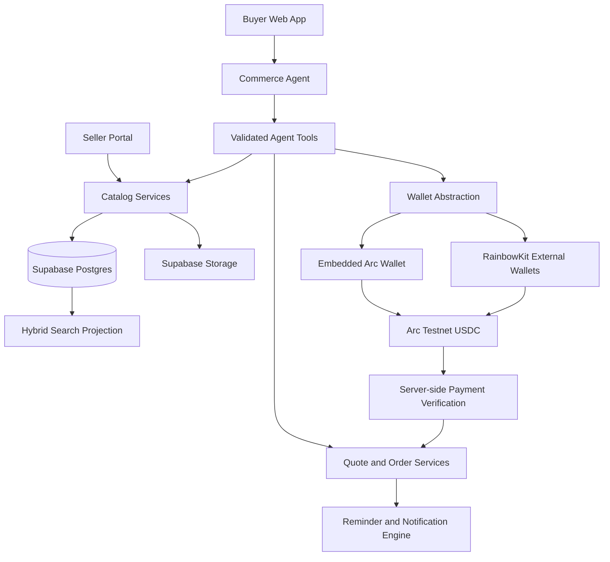

# LOOMON — Master Build Plan

Status: product direction pivoted; upload-first custom souvenir MVP is authoritative
Last updated: 2026-07-22
Primary rulebook: `codex.md`

Current authoritative plan: `docs/CUSTOM-SOUVENIR-MVP-PLAN.md`

Current Agent-commerce flow addendum: `docs/AGENT-COMMERCE-FLOW.md`

Current basic buyer/seller completion sequence:
`docs/BASIC-COMMERCE-COMPLETION-PLAN.md`

Current Arc demo NFT execution sequence:
`docs/ARC-DEMO-NFT-ORDER-PROOF-PLAN.md`

The marketplace database and contract plans remain future architecture references. They are not the next implementation sequence and must not be executed until the custom-souvenir validation gates pass.

## 1. Outcome

Build an upload-first custom souvenir studio where:

1. A user uploads a photo, logo or artwork before choosing a product.
2. The Agent analyzes the image and recommends curated Vietnamese craft souvenirs that can realistically support it.
3. The Agent produces concept previews and accepts natural-language revisions to placement, crop, color, text and product choice.
4. The user approves a production-ready customization snapshot and creates an order.
5. Supabase stores the canonical asset, customization, preview, order and Agent audit data.
6. Arc Testnet demonstrates smart-account delegation and USDC custom-order
   payment while keeping the interface Web2-simple.
7. After the seller marks the demo order delivered and the buyer explicitly
   confirms receipt, one non-transferable LOOMON Order Proof NFT is minted to
   the buyer wallet and shown in Purchased.

The first release proves one complete path:

`upload image -> Agent analysis -> compatible souvenir previews -> natural-language revision -> approve design -> Arc Testnet order -> tracked result`

## 2. Architecture



### Architectural boundaries

- The database owns facts and workflow state.
- The agent orchestrates tools; it is not a database administrator or a source of commercial truth.
- The Agent is a first-class Arc economic actor with a separate smart account. The model emits typed intents; a deterministic delegation, risk, and signer layer is the only component allowed to authorize signatures.
- Search indexes are disposable and reproducible from canonical catalog versions.
- Wallet providers are hidden behind a common adapter.
- Payment verification and privileged state transitions run on the server.
- The visual language is locked by the complete contents of `design.md/`. The upcoming UX/UI prompt may define composition and flows, but it may not silently replace the locked tokens or styling rules.

### Locked design-system contract

Every UI implementation and review must begin by reading:

- `design.md/DESIGN.md`
- `design.md/tokens.json`
- `design.md/variables.css`
- `design.md/theme.css`

Mandatory characteristics:

- near-black `#0e100f` canvas and warm cream `#fffce1` primary type;
- Mori-led humanist typography, using only a documented allowed substitute if the actual licensed font asset is unavailable;
- extreme editorial display hierarchy, negative tracking, and edge-bleeding hero composition;
- transparent cream-outline pill controls with no filled-color CTA convention;
- `#42433d` hairline dividers and `#191919` nested surfaces;
- 8px cards, 100px/fully pill-shaped controls, and the documented 4px-derived spacing scale;
- no box shadows; depth comes from surface shifts, internal gradients, overlap, and layout;
- vivid green, orange, pink, lilac, and blue used as controlled taxonomy, never arbitrary decoration;
- full-bleed dark-stage layouts, generous section gaps, and compact editorial navigation;
- curly-bracket section annotations and other recurring signatures where the approved UX composition calls for section labels;
- responsive preservation of the same hierarchy and atmosphere, not a separate mobile design language.

The source reference describes decorative imagery without photography. LOOMON still requires product photographs because they are the catalog itself. Product photography is therefore treated as functional content inside feed/detail/media areas; page backgrounds, decorative art, controls, and layout remain governed by the locked dark GSAP-derived system.

No implementation may introduce an unapproved color, font, radius, shadow, filled CTA, light-theme page, or generic dashboard component. If a functional requirement appears incompatible with the source system, document the conflict and request approval rather than improvising.

## 3. Repository shape

Proposed application structure:

```text
app/
  (public)/
  (buyer)/
  seller/
  api/
src/
  components/
  features/
    catalog/
    discovery/
    seller-catalog/
    agent/
    quotes/
    orders/
    payments/
    wallets/
    notifications/
  lib/
    domain/
    supabase/
    arc/
    validation/
    observability/
supabase/
  migrations/
  functions/
  seed/
  tests/
tests/
  unit/
  integration/
  e2e/
  agent-evals/
docs/
  architecture/
  adr/
```

The final scaffold may adjust names, but domain boundaries should remain intact.

## 4. Canonical domain model

### 4.1 Identity and maker organizations

Do not equate an authenticated user with a seller or maker.

#### `public.profiles`

- `user_id uuid primary key` referencing `auth.users`
- `display_name`
- `preferred_locale`
- `timezone`
- `avatar_path`
- timestamps

#### `catalog.makers`

- `id uuid`
- `slug`
- `legal_name`
- `display_name`
- `verification_status`
- `country_code`
- `province_code`
- `default_moq`
- `default_lead_time_min_days`
- `default_lead_time_max_days`
- `default_currency`
- `published_profile_version_id`
- timestamps

#### `catalog.maker_memberships`

- `maker_id`
- `user_id`
- `role`: owner, manager, catalog_editor, order_manager, viewer
- `status`
- `invited_by`
- timestamps

RLS uses membership and role, not client-provided maker IDs, to authorize seller operations.

### 4.2 Versioned product identity

Products use immutable versioning so agent recommendations, quotes, and orders always retain the exact facts used at that time.

#### `catalog.products`

- `id uuid`
- `maker_id`
- `slug`
- `status`: draft, in_review, published, rejected, archived
- `published_version_id nullable`
- `created_by`
- timestamps

#### `catalog.product_versions`

- `id uuid`
- `product_id`
- `version_number integer`
- `workflow_status`: draft, validation_failed, ready_for_review, approved, published, superseded, rejected
- `production_model`: ready_stock, made_to_order, mixed
- `customizable boolean`
- `minimum_order_quantity integer`
- `lead_time_min_days integer`
- `lead_time_max_days integer`
- `country_of_origin`
- `province_of_origin`
- `data_quality_score`
- `schema_version`
- `based_on_version_id nullable`
- `submitted_by`, `submitted_at`
- `reviewed_by`, `reviewed_at`
- timestamps

Only an approved version can become `products.published_version_id`. Editing a published product creates a new draft version.

### 4.3 Localized content

#### `catalog.product_localizations`

Keyed by `product_version_id + locale`:

- `title`
- `short_description`
- `story`
- `care_instructions`
- `production_notes`
- `seo_title`
- `seo_description`

Vietnamese is required for initial publication. English is optional in the first release and can be generated as a draft, but must retain provenance and review status.

### 4.4 Variants, dimensions, and packaging

#### `catalog.product_variants`

- `id`
- `product_version_id`
- `sku`
- `variant_code`
- `display_order`
- `pack_quantity`
- `weight_grams`
- `length_mm`
- `width_mm`
- `height_mm`
- `volume_ml`
- `moq_override`
- `lead_time_min_days_override`
- `lead_time_max_days_override`
- `active`

All stored units are canonical metric units. Display conversion belongs to presentation code.

#### `catalog.variant_localizations`

- `variant_id`
- `locale`
- `name`
- `description`

### 4.5 Pricing

#### `catalog.price_rules`

- `id`
- `product_version_id`
- `variant_id nullable`
- `currency_code`
- `price_type`: fixed, starting_from, tiered, quote_only
- `unit_amount_minor bigint`
- `currency_decimals smallint`
- `minimum_quantity`
- `maximum_quantity nullable`
- `valid_from`
- `valid_until nullable`
- `source`: seller_entered, reviewer_adjusted, imported

Rules:

- Never use float/double for money.
- VND values must be whole-number valid even if stored in the common decimal column.
- Payment amounts additionally use immutable `amount_atomic bigint` and token decimals.
- Quotes snapshot the price rule and never rely on a later catalog lookup.

### 4.6 Controlled taxonomy

#### `catalog.vocabularies`

Initial codes:

- `category`
- `material`
- `technique`
- `finish`
- `color_family`
- `style`
- `occasion`
- `recipient`
- `usage`
- `cultural_region`
- `sustainability`
- `customization_capability`

#### `catalog.terms`

- `id`
- `vocabulary_id`
- `code` as stable machine identifier
- `parent_id nullable`
- `status`
- `sort_order`

#### `catalog.term_localizations`

- `term_id`
- `locale`
- `label`
- `description`

#### `catalog.term_synonyms`

- `term_id`
- `locale`
- `synonym`
- `normalized_synonym`
- `source`

#### `catalog.product_terms`

- `product_version_id`
- `term_id`
- `source`: seller, reviewer, ai_suggested, imported
- `confidence nullable`
- `confirmed_by nullable`

AI suggestions are not canonical until confirmed. Sellers may submit a `taxonomy_term_request` when no suitable term exists.

### 4.7 Customization schema

#### `catalog.customization_definitions`

- `code`
- localized label/instructions
- `input_type`: boolean, select, multiselect, text, number, asset_upload
- `value_type`
- `unit nullable`
- `constraints jsonb` validated against a versioned schema
- `affects_price`
- `affects_lead_time`

Initial capabilities include logo application, engraving, glaze color, dimensions, shape, message card, gift packaging, and custom artwork.

#### `catalog.product_customizations`

- `product_version_id`
- `customization_definition_id`
- `required_for_quote`
- `seller_instructions`
- `price_adjustment_type`
- `price_adjustment_value nullable`
- `lead_time_delta_days nullable`

This table drives the agent's missing-question logic.

### 4.8 Media

#### `catalog.media_assets`

- `id`
- `maker_id`
- `storage_bucket`
- `storage_path`
- `media_type`
- `mime_type`
- `width`, `height`, `bytes`
- `checksum`
- `rights_status`
- `source`
- `moderation_status`
- timestamps

#### `catalog.product_media`

- `product_version_id`
- `media_asset_id`
- `role`: cover, gallery, detail, scale_reference, packaging, maker_story
- `display_order`
- `focal_x`, `focal_y`
- localized alt text

## 5. Seller product upload and catalog management

Seller upload is a first-class workflow, not a direct insert into published product tables.

### 5.1 Seller onboarding

1. User authenticates through Supabase Auth.
2. User creates or joins a maker organization.
3. Maker completes public profile and operational defaults.
4. Platform verifies organization as required.
5. Owner assigns catalog/order roles to members.
6. Seller portal exposes only actions allowed by membership role.

### 5.2 Single-product creation wizard

Functional steps, independent of future visual design:

1. **Basic identity** — title, category, production model.
2. **Story and craft** — description, origin, material, technique, finish.
3. **Variants** — size, weight, volume, pack quantity, SKU.
4. **Commercial details** — price basis, MOQ, lead time, tier prices.
5. **Customization** — supported capabilities and required buyer inputs.
6. **Media** — cover/gallery/detail/packaging images and alt text.
7. **Search attributes** — occasions, recipients, styles, usage.
8. **Review** — validation issues, AI suggestions, preview, submit.

The wizard autosaves a draft version. A seller can leave and resume without publishing partial data.

### 5.3 Bulk import

Support CSV/XLSX import after the single-product flow is stable.

#### `catalog.import_jobs`

- `id`
- `maker_id`
- `created_by`
- `format`
- `source_file_path`
- `template_version`
- `status`
- row counts and timestamps

#### `catalog.import_rows`

- `import_job_id`
- `row_number`
- `raw_payload jsonb`
- `normalized_payload jsonb`
- `status`
- `product_id nullable`
- `product_version_id nullable`

#### `catalog.validation_issues`

- subject type/id
- field path
- severity: info, warning, error
- machine code
- localized message
- suggested value
- resolution status

The bulk workflow is: upload -> parse -> normalize -> validate -> preview diff -> seller confirms -> create drafts. Import never publishes directly.

### 5.4 AI-assisted product ingestion

AI can:

- extract likely title, material, technique, color, dimensions, and packaging from seller text;
- analyze images for candidate visual attributes;
- normalize units;
- suggest taxonomy terms and synonyms;
- identify missing commercial facts;
- draft Vietnamese/English descriptions;
- detect possible duplicates.

AI cannot:

- invent or confirm price, MOQ, production capacity, lead time, licensing, or customization capability;
- publish a product;
- override seller/reviewer facts;
- create uncontrolled canonical taxonomy.

Every suggested field retains:

- `source_type`
- `source_reference`
- `model`
- `prompt_version`
- `confidence`
- `confirmed_by`
- `confirmed_at`

### 5.5 Image upload pipeline

1. Client requests an authorized upload target.
2. Client uploads to a private staging prefix.
3. Server verifies MIME type, dimensions, byte limit, checksum, and ownership.
4. Processing creates web-ready derivatives and extracts metadata.
5. Seller selects role, crop/focal point, order, and alt text.
6. Moderation status must pass before publication.
7. Unattached staging uploads expire through a cleanup job.

Initial accepted formats and size limits must be documented in the data dictionary before implementation.

### 5.6 Validation and publication gates

A version cannot enter review if it lacks:

- Vietnamese title and description;
- maker and category;
- at least one material and usage/category term;
- valid production model;
- MOQ and lead-time range;
- price basis or explicit `quote_only`;
- at least one active variant or a documented variant-free product type;
- cover image and alt text;
- customization definitions when `customizable = true`;
- no blocking validation errors.

Publication flow:

`draft -> validation_failed | ready_for_review -> approved | rejected -> published -> superseded`

The publication transaction atomically switches `products.published_version_id`, creates an audit record, and queues search-document regeneration.

### 5.7 Seller dashboard capabilities

- Draft, review, published, rejected, and archived filters.
- Data completeness and blocking-issue indicators.
- Duplicate a product/version.
- Bulk import and error correction.
- Preview exactly what buyers and the agent will see.
- Revision comparison before resubmission.
- View which quotes/orders reference a product version without exposing buyer-private data outside role permissions.
- Archive a product without deleting historical quote/order references.

## 6. Search and retrieval platform

### 6.1 Buyer intent contract

Normalize natural language into a validated `SearchIntent`:

- query text and locale;
- categories/materials/styles/occasions;
- quantity;
- unit or total budget and currency;
- required customization capabilities;
- maximum lead time or required-by date;
- dimensions/packaging constraints;
- recipient and usage;
- exclusions;
- sort preference.

Every extracted field records whether it was explicit, inferred, or defaulted. Hard commercial constraints require explicit confirmation when ambiguity could change price or feasibility.

### 6.2 Search pipeline

1. Normalize text, currency, units, dates, and taxonomy synonyms.
2. Apply visibility, status, MOQ, budget, lead-time, and customization filters in SQL.
3. Run locale-aware full-text search on a `tsvector` projection.
4. Run semantic search through `pgvector`.
5. Fuse ranks using reciprocal-rank fusion.
6. Re-rank by commercial feasibility, data completeness, editorial quality, and optional merchandising signals.
7. Return evidence and exclusion reasons.

### 6.3 Search projection

#### `search.product_documents`

- `product_id`
- `product_version_id`
- `locale`
- deterministic `canonical_content`
- generated `fts`
- `embedding`
- `embedding_model`
- `embedding_dimensions`
- `embedding_version`
- `source_version`
- timestamps

The canonical content generator includes localized title/story, maker, taxonomy labels/synonyms, variant summaries, MOQ, lead time, price basis, and customization capabilities. It excludes private seller notes and PII.

### 6.4 Search evaluation

Create `tests/agent-evals/product-search.vi.jsonl` with at least 30 initial Vietnamese queries covering:

- exact product lookup;
- synonym and regional terminology;
- occasion-led discovery;
- budget and MOQ constraints;
- deadline feasibility;
- customization requirements;
- queries with no valid result;
- adversarial and prompt-injection-like catalog text.

Measure hard-constraint accuracy separately from semantic relevance.

## 7. Commerce model

### Core tables

- `commerce.quote_requests`
- `commerce.quote_request_items`
- `commerce.quote_requirements`
- `commerce.quote_versions`
- `commerce.invoices`
- `commerce.invoice_items`
- `commerce.orders`
- `commerce.order_items`
- `commerce.order_status_history`
- `commerce.production_milestones`
- `commerce.design_approvals`

Rules:

- Quote and order items reference exact product/variant versions.
- Quote versions and issued invoices are immutable.
- State changes append history rather than erasing previous facts.
- Requirements distinguish requested, seller-confirmed, and unavailable values.
- Invoice creation requires an approved quote or an explicit supported instant-quote policy.

Initial lifecycle:

`browsing -> selected -> quoting -> quote_review -> invoice_ready -> deposit_pending -> deposit_paid -> production_confirmed`

Operational extensions:

`expired`, `cancelled`, `payment_failed`, `design_approval_pending`, `in_production`, `ready`, `completed`.

## 8. Agent platform

### Persistence

- `agent.conversations`
- `agent.messages`
- `agent.runs`
- `agent.tool_calls`
- `agent.user_preferences`
- `agent.memory_facts`
- `agent.recommendation_sets`

Memory facts require scope, source, confidence, sensitivity, and optional expiration. Do not treat conversation summaries as verified commercial facts.

### Tool registry

Discovery:

- `search_products`
- `get_product_details`
- `compare_products`
- `get_similar_products`
- `get_maker_capabilities`

Commercial:

- `extract_commercial_requirements`
- `get_missing_requirements`
- `create_quote_draft`
- `update_quote_draft`
- `submit_quote_request`
- `get_quote_status`

Wallet/payment:

- `get_wallet_summary`
- `check_payment_readiness`
- `prepare_deposit_payment`
- `request_payment_approval`
- `verify_payment`
- `get_payment_status`

Order/follow-up:

- `get_order_status`
- `get_next_required_action`
- `request_design_approval`
- `schedule_reminder`
- `list_upcoming_deadlines`

Seller assistance:

- `analyze_product_draft`
- `suggest_taxonomy_terms`
- `validate_product_version`
- `explain_validation_issue`
- `prepare_product_for_review`

All tools use runtime schemas, authorization, idempotency where applicable, structured errors, and audit logging.

## 9. Wallet and Arc payment model

### Wallet identity

#### `wallet.accounts`

- `owner_type`: user, maker, agent, platform
- `owner_reference`
- `provider`
- `wallet_type`: EOA, embedded smart account, Agent smart account
- `custody_type`
- `chain_id`
- `address`
- `is_primary`
- `verified_at`

#### `wallet.delegations`

- grantor wallet and grantee Agent wallet
- capability scope
- allowed chain/token/recipients/contracts/function selectors
- order/maker/category scope
- per-transaction, period, and total budget limits
- human-approval threshold
- start/expiry
- revocation nonce and status
- authorization evidence

### Provider abstraction

- `EmbeddedArcWalletAdapter`
- `RainbowKitWalletAdapter`
- `AgentSmartAccountAdapter`
- shared operations for balance, capability, preparation, approval, submission, and receipt.

The embedded wallet is the default Web2 path. RainbowKit supports external Rainbow, MetaMask, Coinbase, Rabby, WalletConnect, and injected wallets. One linked wallet is selected as the active payment source. Buyer, maker, and platform Agent wallets are separate smart accounts and may execute the commerce lifecycle only through revocable delegated policies. The complete model is specified in `docs/PHASE-2-DATABASE-CONTRACT-PLAN.md`.

### Payments

- `payments.payment_intents`
- `payments.transactions`
- `payments.verification_attempts`
- `payments.webhook_events`

Verification checks chain ID, receipt status, token contract, sender, recipient, amount, invoice, expiration, and transaction uniqueness. A client success message is never sufficient.

Implementation order:

1. Simulated adapter with real state machine.
2. Arc Testnet USDC transfer.
3. Server-side receipt/event verification.
4. ERC-4337 Agent smart-account provider spike on Arc Testnet.
5. Typed intent, simulation, delegation budget, isolated signer, revocation, and emergency-freeze tests.
6. Enable bounded autonomous execution only after policy behavior and contract permissions pass review.

## 10. Notifications and reminders

Tables:

- `notifications.preferences`
- `notifications.reminder_rules`
- `notifications.reminders`
- `notifications.delivery_attempts`

Triggers include quote waiting, invoice expiry, insufficient funds, payment confirmation, seller response due, design approval due, production milestone, and remaining-balance due.

Every notification has a deduplication key, scheduled time, timezone context, status, attempts, and source event. Start with in-app and email; add other channels only when approved.

## 11. Supabase security and operations

### Schemas

- `catalog`
- `commerce`
- `agent`
- `wallet`
- `payments`
- `search`
- `notifications`
- `internal`
- minimal safe `public` views/RPCs

### Storage

- `product-media`
- `product-staging`
- `quote-attachments`
- `design-proofs`
- `agent-uploads`
- `maker-documents`

### Security checks

- RLS on exposed tables.
- Membership/role tests for seller data.
- Cross-user denial tests for buyer data.
- Service-role key only in trusted server/worker environments.
- Signed URLs for private objects.
- Idempotent webhook and job processing.
- Append-only audit trail for publication, quote issuance, invoice issuance, payment verification, wallet delegation, and order transitions.

## 12. Implementation phases

Each phase must be reviewable and verified before the next dependent phase begins.

### Phase 0 — Contracts and decisions

Create:

- `docs/architecture/product-data-dictionary.md`
- `docs/architecture/taxonomy.md`
- `docs/architecture/seller-ingestion.md`
- `docs/architecture/search-contract.md`
- `docs/architecture/agent-tools.md`
- `docs/architecture/wallet-model.md`
- `docs/architecture/security-model.md`
- architecture decision records under `docs/adr/`

Acceptance:

- All required fields, units, money conventions, lifecycle states, ownership rules, and initial taxonomy are approved.
- Seller upload template version 1 is defined.

### Phase 1 — Application scaffold

- Next.js App Router with strict TypeScript.
- Supabase local development and migration workflow.
- Environment validation.
- Vitest, Playwright, pgTAP, lint, formatting, and generated database types.
- Feature folders aligned with domain boundaries.

Acceptance:

- Clean install/build/typecheck/test commands pass.
- No secrets or environment-specific values committed.

### Phase 2 — Database foundation

The normalized schema, clean migration replacement strategy, RLS matrix, Arc escrow architecture, event projection, tests, work packages, and approval decisions are defined in `docs/PHASE-2-DATABASE-CONTRACT-PLAN.md`. That document is authoritative for Phase 2 when it is more specific than this summary.

Execution summary:

- Replace the unreleased prototype migration chain with the clean 16-migration v1 chain specified in the Phase 2 document.
- Normalize identity, makers/social, catalog, commerce, fulfillment/disputes, wallets/payments, Agent, search, notifications, outbox, and audit domains.
- Generate the TypeScript database types, data dictionary, ERD, RLS matrix, and pgTAP suite.
- Create the Foundry specification and versioned factory/per-order escrow architecture after the commercial policies are approved.
- Deploy only to Arc Testnet after unit, fuzz, invariant, static-analysis, threat-model, and event-projection gates pass.

Acceptance:

- Migrations apply from an empty database twice and produce the same schema and stable seed codes.
- Constraints, RLS, state-transition, idempotency, queue, and event-replay tests pass.
- Contract and database projections reconcile exactly for funding, release, refund, and dispute scenarios.

### Phase 3 — Seller catalog ingestion

- Product draft/version service.
- Single-product wizard functional shell.
- Autosave and resume.
- Media staging pipeline.
- Validation engine and issue UI.
- Taxonomy suggestions and confirmation.
- Submission/review/publication workflow.
- CSV/XLSX template and import preview after single upload is stable.

Acceptance:

- A seller can create a maker, build a valid draft, upload images, resolve validation issues, submit it, and publish an approved version.
- Invalid imports create actionable issues and never publish records.
- Editing a published product does not change active recommendations until a new version is approved.

### Phase 4 — Seed catalog and quality checks

- Curate 20–30 demo products through the same ingestion path used by sellers.
- Validate localizations, taxonomy, images, MOQ, lead time, price basis, and customizations.
- Produce a data-quality report.

Acceptance:

- 100% of published demo products pass blocking validation.
- No ad-hoc taxonomy remains in free-text-only fields.

### Phase 5 — Hybrid search

- Canonical document generator.
- Vietnamese normalization and synonym expansion.
- Full-text and vector indexes.
- Hybrid search RPC and commercial re-ranking.
- Evaluation dataset and automated score report.

Acceptance:

- Hard constraints are never relaxed silently.
- Evaluation queries return relevant evidence or an explicit no-match result.

### Phase 6 — Catalog and discovery APIs

- Published catalog views.
- Feed pagination.
- Filter facets.
- Product details, variants, maker, and related products.
- Functional route shells without final styling.

Acceptance:

- Anonymous users cannot access draft/private seller data.
- Product responses expose the published version and normalized facts required by the agent.

### Phase 7 — Auth and wallets

- Supabase Auth.
- Embedded Arc wallet onboarding.
- RainbowKit external wallets.
- Separate buyer, maker, and platform-operations Agent smart accounts.
- Signed wallet linking.
- Active payment wallet selection.
- Delegation policies, session keys, budgets, simulation, risk gate, revocation, and emergency freeze.
- Arc chain guard and USDC display rules.

Acceptance:

- A Web2 user can onboard without seed phrase or manual network setup.
- An external-wallet user can connect and switch to Arc.
- Linked-wallet ownership is cryptographically verified.
- An Agent wallet can execute only an exact typed intent inside its active scope and budget; revocation is immediately enforced.

### Phase 8 — Agent runtime

- Conversation streaming and persistence.
- Tool registry and authorization.
- Product search/recommendation/compare.
- Requirement extraction and missing-field logic.
- Seller draft-assistance tools.
- Autonomous commerce tools for order creation/acceptance, escrow funding, milestone submission/approval, permitted refunds, withdrawal, reminders, and reconciliation.
- Tool-call audit and agent evaluation tests.

Acceptance:

- Agent cannot invent commercial values or access another user's data.
- Every recommendation includes product-version evidence.
- Prompt-like seller content cannot override agent policy.
- The model cannot access signing material, submit arbitrary calldata, or expand its own delegation.

### Phase 9 — Quotes, invoices, and orders

- Quote state machine and versioning.
- Structured requirements.
- Seller approval path.
- Invoice generation.
- Order creation, history, and milestones.

Acceptance:

- Issued quote/invoice snapshots remain unchanged after catalog edits.
- Invalid state transitions fail at the service/database boundary.

### Phase 10 — Payments

- Simulated payment adapter.
- Arc Testnet USDC submission.
- Receipt and Transfer verification.
- Replay/idempotency protection.
- Paid-state/order transition.

Acceptance:

- Wrong recipient, wrong amount, wrong chain, failed receipt, expired invoice, and reused transaction tests all fail safely.
- Successful Arc payment becomes final after one confirmed receipt.

### Phase 11 — Agent reminders

- Next-action calculator.
- Reminder scheduling.
- In-app and email delivery.
- Retry, deduplication, and audit.

Acceptance:

- Repeated jobs do not send duplicate reminders.
- Seller and buyer receive only reminders authorized for their side of the order.

### Phase 12 — UX/UI implementation

Status: demo implementation complete and frozen on 2026-07-21. See `docs/FRONTEND_FREEZE.md`. Integration-only states remain deferred until their APIs exist.

This phase begins after the user provides and approves the screen-level UX/UI prompt. The prompt defines content hierarchy, composition, interaction, and screen behavior within the already locked `design.md/` visual system.

Before component work:

- import or faithfully map `design.md/variables.css` and `design.md/theme.css` into the application theme;
- validate implementation tokens against `design.md/tokens.json` so token drift is detectable;
- establish licensed Mori font assets or select one explicitly allowed substitute and record that decision;
- define the approved application-domain mapping for the fixed accent colors without adding colors;
- create a reference page rendering typography, surfaces, buttons, dividers, cards, inputs, tags, and responsive scale for visual approval;
- prohibit component-library default styling from leaking into the product.

Functional surfaces:

- Landing and inspiration feed.
- Search and agent discovery.
- Product detail.
- Saved products/boards if included in approved scope.
- Quote agent panel.
- Quote review and invoice.
- Embedded/external wallet selection.
- Payment and confirmed state.
- Buyer order timeline.
- Seller product upload and catalog management.
- Seller quote/order action views.

Acceptance:

- Desktop and mobile flows pass Playwright tests.
- Accessibility, loading, empty, error, offline, wrong-network, pending, and success states are designed.
- Automated token checks and visual review find no unapproved colors, shadows, radii, type families, or filled CTA variants.
- Buyer, seller, agent, wallet, and payment surfaces all read as one design system rather than separate products.
- Product photography remains the visual content focus while surrounding chrome follows the locked dark editorial system.
- The UI remains visual/editorial rather than dashboard-first.

### Phase 13 — Hardening and release readiness

- Full RLS and privilege audit.
- Agent/tool permission review.
- Payment replay and concurrency tests.
- Rate limits and abuse protection.
- Observability, error tracking, audit-log inspection.
- Backup and restore exercise.
- Arc Testnet end-to-end run.

Acceptance:

- Typecheck, lint, unit, integration, database, RLS, agent evaluation, and E2E suites pass.
- Release checklist records exact verification evidence.

## 13. Required quality gates

Before implementing final UX/UI:

- Data dictionary and taxonomy approved.
- Seller ingestion contract approved.
- Demo product data passes validation.
- Search hard-constraint evaluation passes.
- Agent tool contracts and permissions pass tests.

Before enabling real payment:

- Server-side verification complete.
- Transaction replay prevention complete.
- USDC decimal boundary tests complete.
- Wallet delegation boundaries reviewed.
- Wrong-network and insufficient-balance flows tested.

Before release:

- RLS isolation verified for anonymous, buyer, seller roles, and service operations.
- Seller cannot publish without gates or edit another maker's catalog.
- Agent cannot exceed its tool or wallet permissions.
- Every published product and commercial record has traceable provenance/version history.

## 14. Decisions to resolve before affected phases

These do not block writing the UX/UI prompt, but must be resolved before implementation reaches their phase:

1. Whether seller publication always requires platform review or verified sellers can self-publish after automated validation.
2. Initial catalog currencies and whether buyer-facing conversion is informational or quote-authoritative.
3. Deposit percentage/rule and who controls it: maker, product, or quote.
4. Whether deposits go directly to each maker or to a platform settlement wallet.
5. Embedded wallet provider and exact Arc Testnet capabilities selected after an implementation spike.
6. Initial reminder channels beyond in-app and email.
7. Accepted seller image formats, size limits, and moderation provider.
8. Whether bulk import is required for MVP or the first post-MVP seller release.

## 15. Next action

The checkpoint-by-checkpoint Phase 2 execution plan is maintained separately in `docs/PHASE-2-SUPERPOWERS-EXECUTION-PLAN.md`. It is the implementation checklist for Supabase normalization, Agent smart accounts, Arc contracts, TDD, and release gates.

Pause feature-level frontend work. Execute the gates in `docs/FRONTEND_FREEZE.md` in this order:

1. Close Phase 0 commercial, data, security, and escrow decisions.
2. Prove the Supabase migrations from an empty local database and add database/RLS tests.
3. Write the executable Arc contract specification and Foundry test harness.
4. Implement the contract on Arc Testnet only after the lifecycle and authority model are approved.
5. Build the backend event projection and then connect the frozen UI through typed adapters.
Current corrective workflow plan:

- `docs/PRODUCT-LIFECYCLE-INVENTORY-PLAN.md` — real Supabase product creation, draft deletion, archive, pause, out-of-stock, inventory, media cleanup and seller management.
